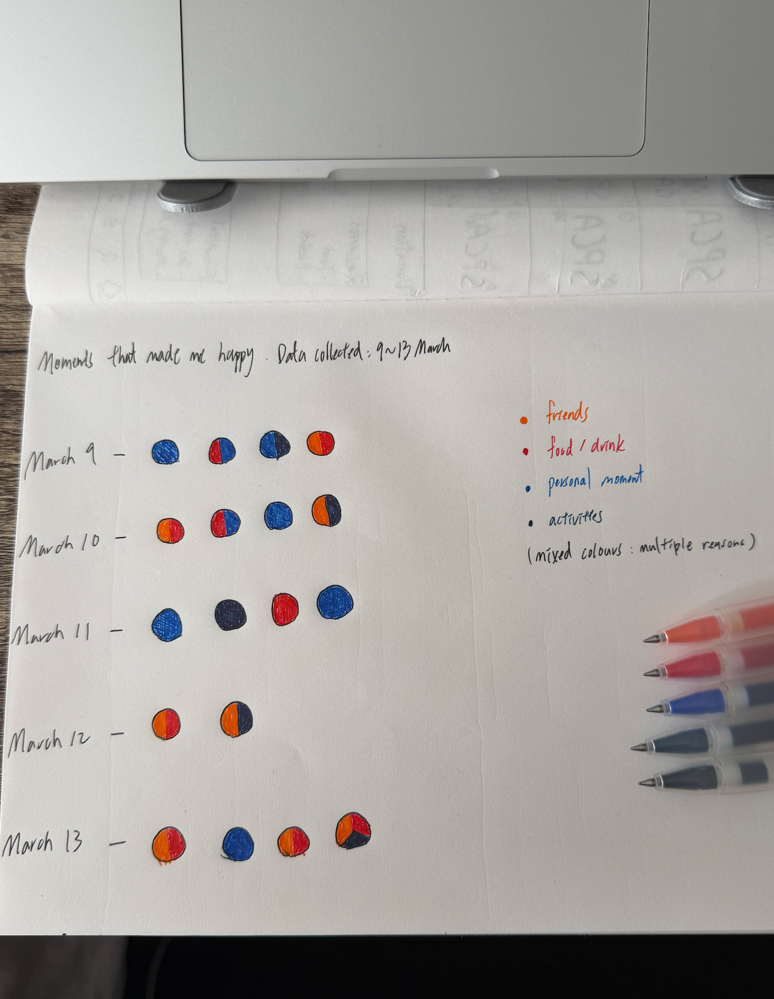
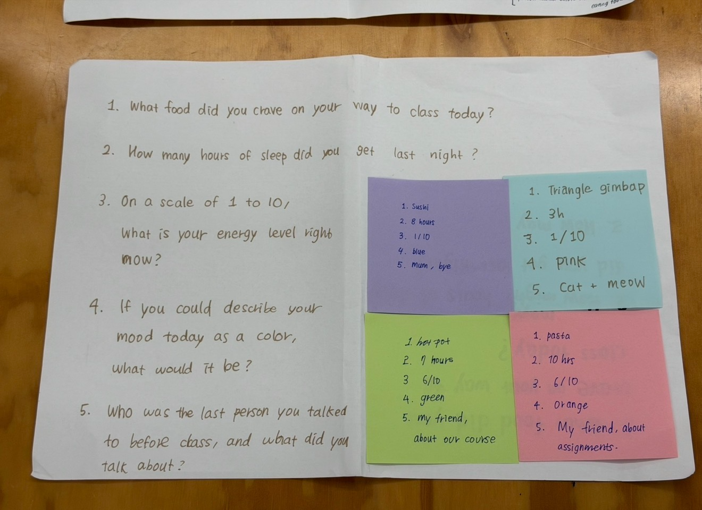
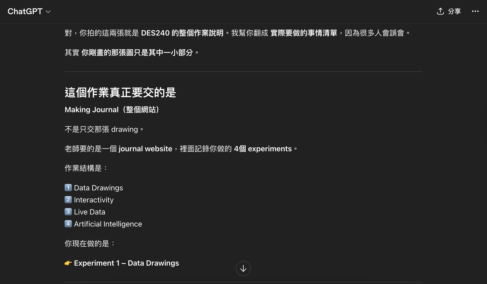

# Week 01

[← Back to Home](../index.md)

## Documentation 

In the first week, I began to explore the concept of "design with data." I learned that data is not just technical, but can also be seen as a design material that can be used to express ideas and stories. This week made me relise that data actually influences how we understand the world. Through collection, organisation, and visualization, data can be transformed into different forms, and the role of designers is to make this data easier to understand and more meaningful. What impressed me most was the concept of "data humanism," which emphasises that data is not just impersonal information, but can also be connected to people's emotions and daily lives. Which made me start thibking about wheater data can be used to express personal experiences and emotions. 
In conclusion, this week made me relise that data design is not just about presenting information, but also a way of storytelling. I am very interested in transforming my personal life into data visualizations, so in subsequent experiments, I chose to record moments that made me happy and try to present them visually.

## Images & Media

*My documentation of "What made me happy(from 9~13 March)"*

I created a data visualization themed "Moments That Make Me Happy." Between March 9th and March 13th, I recorded moments of joy in my daily life, transforming these everyday experiences into observable data.In this work, each dot represents a moment that made me happy. I used different colors to distinguish different types of happiness, such as interacting with friends, eating, personal time, or other activities. This design gives each visual element a clear meaning, forming a simple yet clear data system. I chose to use simple circles as the basic element to keep the overall image clean and avoid excessive decoration that might hinder data comprehension. At the same time, the use of color adds an emotional dimension to the work, making the data not just information but also convey personal feelings.

*In-class group activity (data drawing exercise)*

*Our original group activity*

This was our original group work. We decided to redo it with a more engaging questions to create a more creative drawing.*

## AI Usage Statement

*Screenshot of ChatGPT*

I used ChatGPT as a support tool to better understand the instructions in a language I am more comfortable with. It helped clarify concepts and improve my understanding.