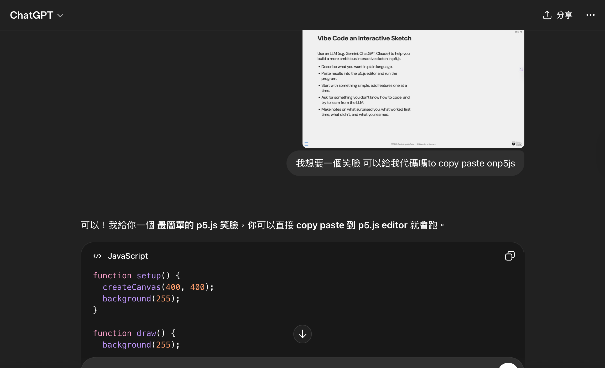
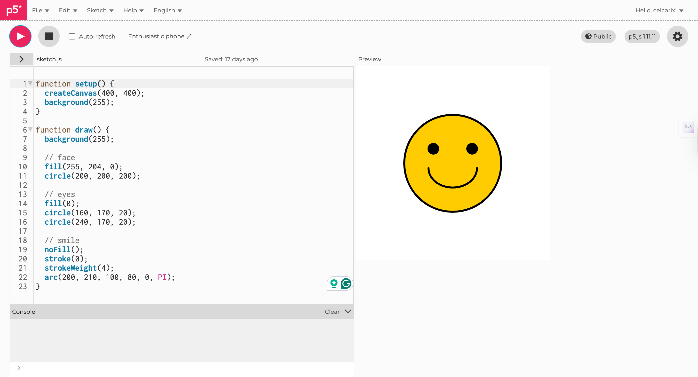

# Week 02

[← Back to Home](../index.md)

## Documentation 

This week in class, we used p5.js for this project. Initially, I was unfamiliar with it because I have no coding experience, so I was a little overwhelmed when I first saw the code. However, after the in-class exercises, I gradually understood the basic logic of p5.js, such as canvas creation, graphic drawing, and how to control shape, color, and position through simple commands. I started with basic graphics, such as smiley faces and stars. These exercises helped me understand how to build elements within a visual structure and familiarize me with program structure. Although the results seemed simple, it was an important start for me because it was the first time I was creating visuals through a program, rather than just drawing by hand or using design software.

This week's experiments made me realize that everyday things can be transformed into data and become more meaningful through visualization. Another major focus this week was p5js. Learning some basics from having no coding experience was very helpful in this course. Although it was frustrating because I kept getting errors at the beginning, with the help of the teaching assistant, I finally got my code working.
## Images & Media

*The GIF of the p5.js animation*

## AI Usage Statement

*The screenshot of the code that ChatGPT provided to create a smiley face on p5.js*

I askede ChatGPT to generate a code of smiley face for me to paste on p5.js, the screenshots show the process and result.