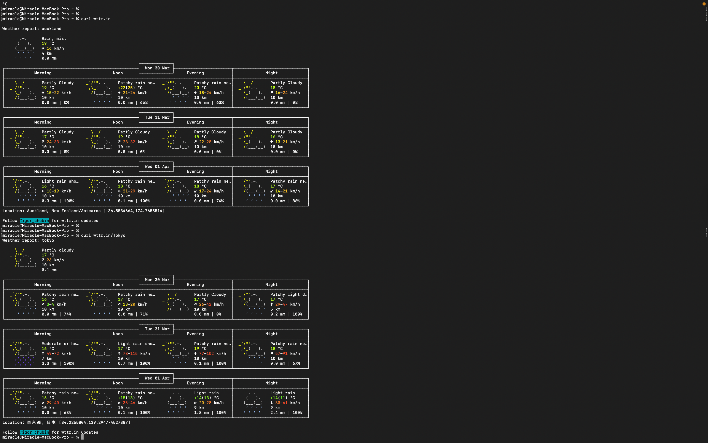
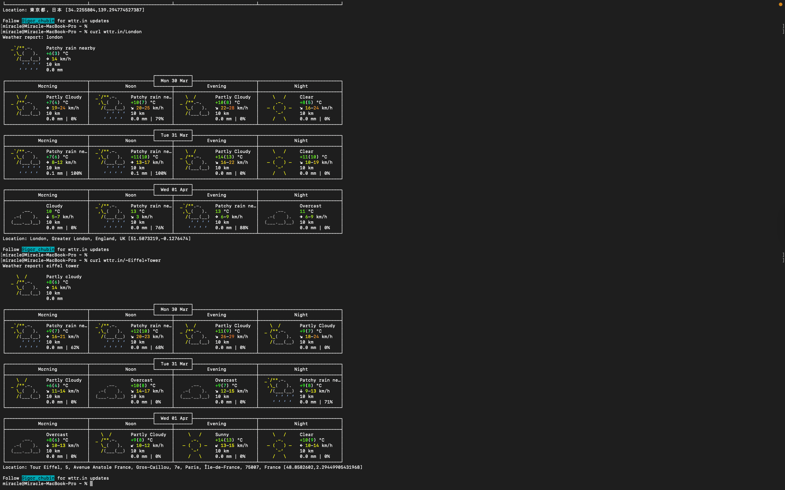
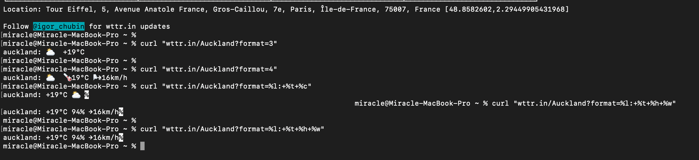
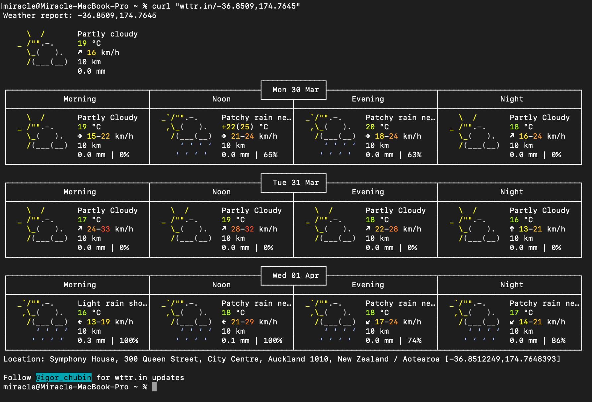
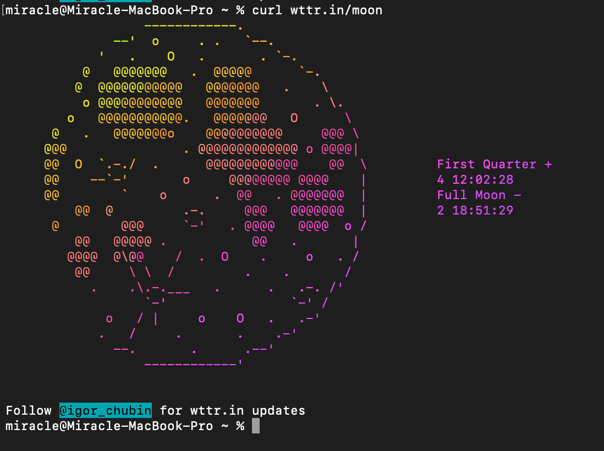
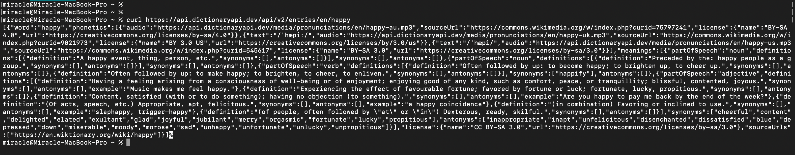
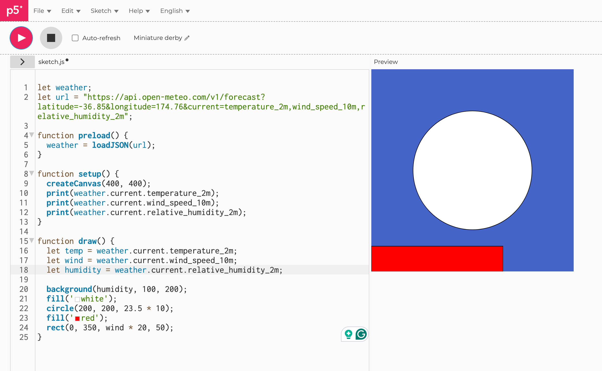
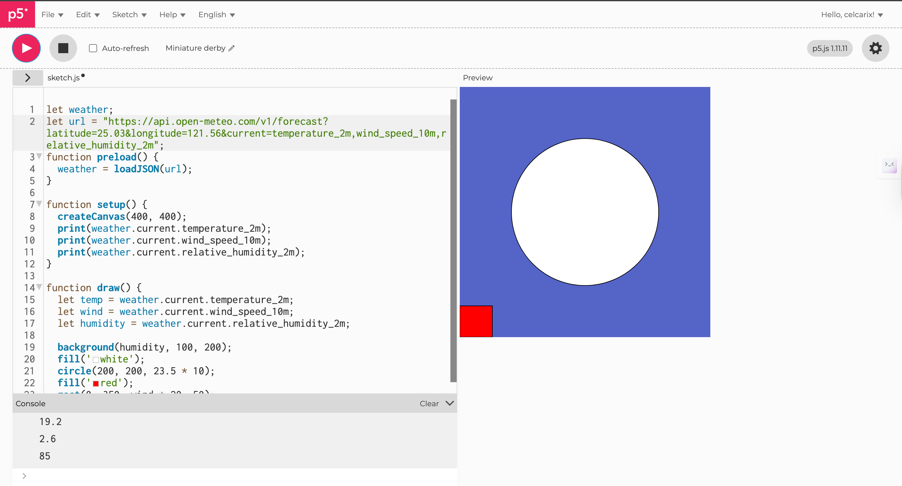
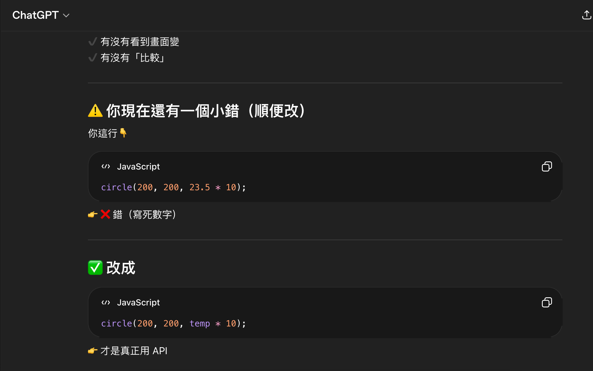

# Week 03

[← Back to Home](../index.md)

## Documentation 

*Include your documentation for the week. Devise your own structure of headings relevant to the required tasks and your process.*

## Images & Media
*Terminal-ASCII Animations*

*Terminal-Weather in different location*

I tried out checking the weather through terminal in our location and in different locations, such as Tokyo, London, and Eiffel Tower. Afterwards, I tried out something more advanced which is filtering data. Different code shows different data such as the humidity and the wind.

*Terminal-Weather GPS Coordinates*

*Terminal- Weather in different language*

*Terminal-Moon Phase*

*Terminal-Synonyms/Antonyms*

*Using an API in p5.js*

*Using an API in p5.js-after changing the latitude and longitude*

*ISS Tracker*

## AI Usage Statement
*The screenshot of ChatGPT correcting my code on p5.js*

In this assignment, I used ChatGPT as a tool to help me understand how to visualize data using APIs and p5.js. During the process, it also helped me debug the program. For example, when the display did not meet expectations, it provided modification suggestions, ensuring that my visual results correctly reflected the real-time data. However, I found that the code provided by ChatGPT sometimes required adjustment; for example, some values ​​or visual effects did not necessarily meet the design expectations. Therefore, I still needed to understand and modify the program content rather than directly copying and using it. This process helped me better understand the program logic and how data is transformed into visual elements. Overall, ChatGPT provided significant assistance in the early stages of learning, especially in understanding concepts and solving problems, but the final testing and adjustments still needed to be completed by myself to ensure the work met expectations.