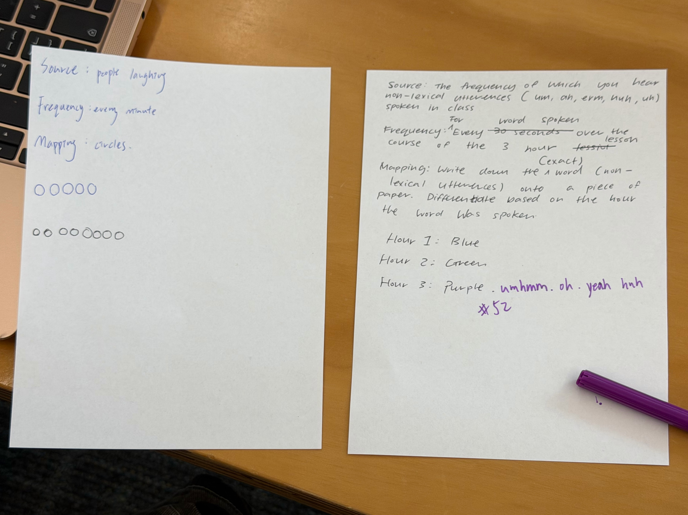

# Week 03

[← Back to Home](../index.md)

## Documentation 

This week’s experiments primarily explored how different tools can be used to present data, particularly the terminal and p5.js. I first tried a different function on the terminal. such as querying weather data, observing how the data was quickly presented in text form. This made me realise that data doesn't necessarily need complex images to be understood. 
Besides the weather function, I also explored ASCII art. Through this method, the program is not just a tool for executing instructions, but can also produce visually appealing results. This was very interesting to me because it blurs the lines between data, text, and images, making the terminal appear not just as a technical interface, but as a medium that can be designed and viewed. I also tried using p5.js to present weather data, transforming the relatively static information on the terminal into a more visual form. Through this, I began to think about the differences in how the same data could be presented on different media and how different presentation methods lead to different reading experiences. 
Overall, the exercises this week have helped me understand that there are various ways of presenting data. Whether it’s text output in the terminal or ASCII art, they all show me that data can be both informative and expressive. 

## Images & Media
*Terminal-ASCII Animations*
(Screen Recordings)

<video controls width="100%">
  <source src="../assets/week-03/screen-recording2.mp4" type="video/mp4">
</video>

<video controls width="100%">
  <source src="../assets/week-03/screen-recording3.mp4" type="video/mp4">
</video>

<video controls width="100%">
  <source src="../assets/week-03/screen-recording4.mp4" type="video/mp4">
</video>

*Terminal-Weather in different location*

I tried out checking the weather through terminal in our location and in different locations, such as Tokyo, London, and Eiffel Tower. Afterwards, I tried out something more advanced which is filtering data. Different code shows different data such as the humidity and the wind.

*Terminal-Weather GPS Coordinates*

*Terminal- Weather in different language*

*Terminal-Moon Phase*

*Terminal-Synonyms/Antonyms*

*Using an API in p5.js*

*Using an API in p5.js-after changing the latitude and longitude*

*ISS Tracker*

<video controls width="100%">
  <source src="../assets/week-03/screen-recording1.mp4" type="video/mp4">
</video>

*Design a Data Protocol*

The paper on the left was our group's data protocol, the paper on the right was other group's data protocol. After switching up with them, we explored more about different ways of collecting data. Suprisingly, the data we got were a lot less then we expected. Also, the other group's instruction were a lot more clear than our's, which made me had a think about making a more specific requirements when it comes to a activity like this in the future.

## AI Usage Statement
*The screenshot of ChatGPT correcting my code on p5.js*

In this assignment, I used ChatGPT as a tool to help me understand how to visualize data using APIs and p5.js. During the process, it also helped me debug the program. For example, when the display did not meet expectations, it provided modification suggestions, ensuring that my visual results correctly reflected the real-time data. However, I found that the code provided by ChatGPT sometimes required adjustment; for example, some values ​​or visual effects did not necessarily meet the design expectations. Therefore, I still needed to understand and modify the program content rather than directly copying and using it. This process helped me better understand the program logic and how data is transformed into visual elements. Overall, ChatGPT provided significant assistance in the early stages of learning, especially in understanding concepts and solving problems, but the final testing and adjustments still needed to be completed by myself to ensure the work met expectations.