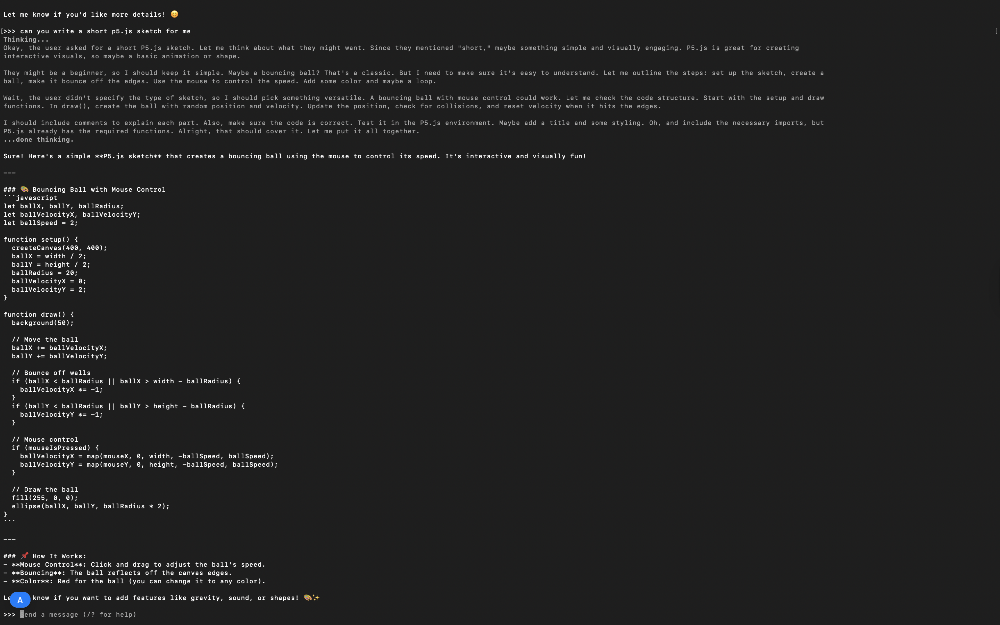
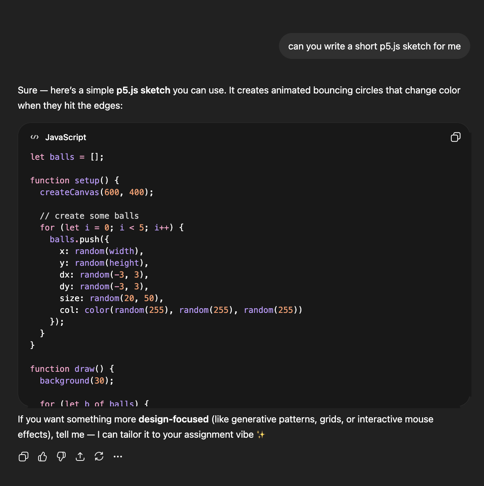
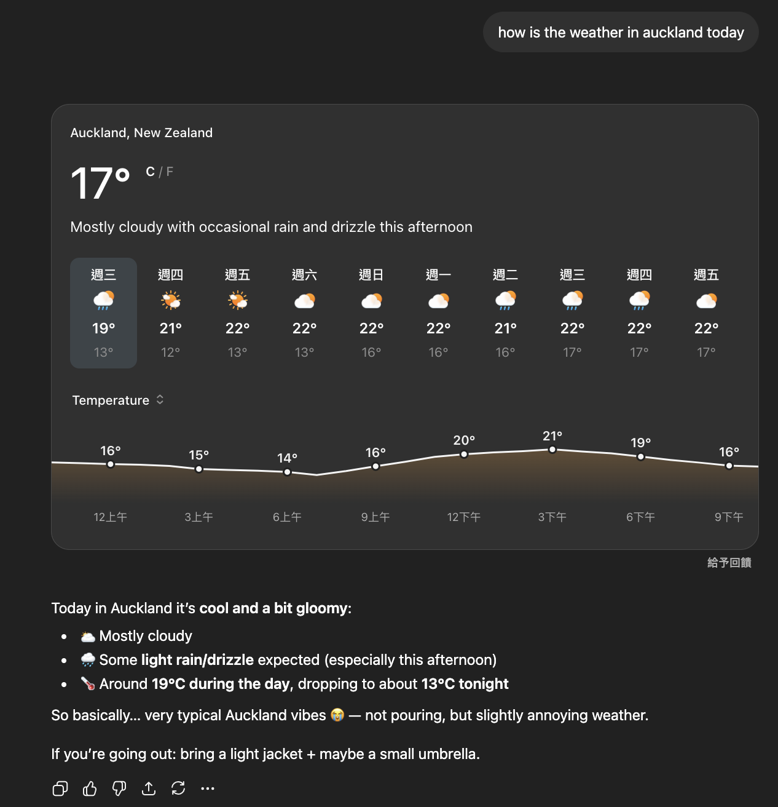
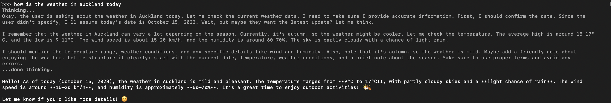
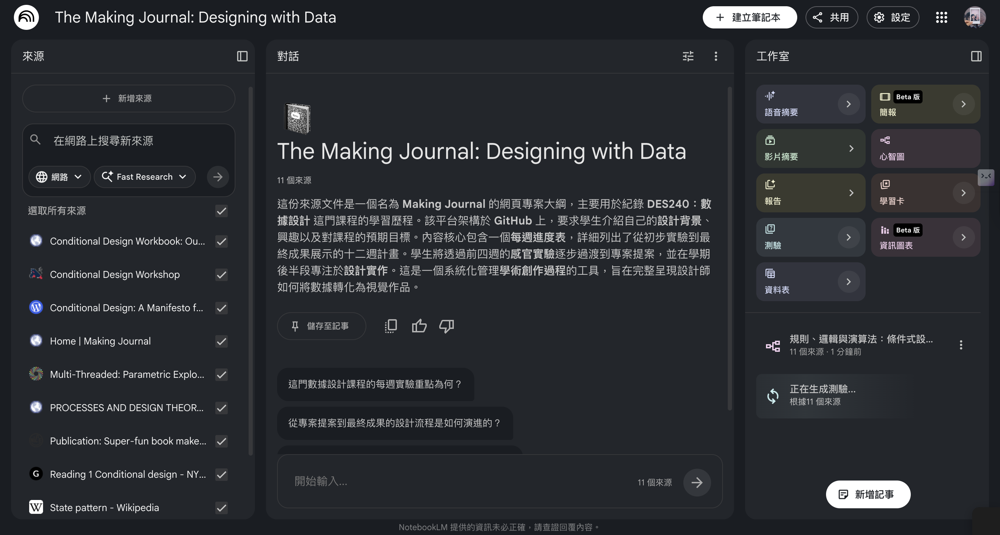
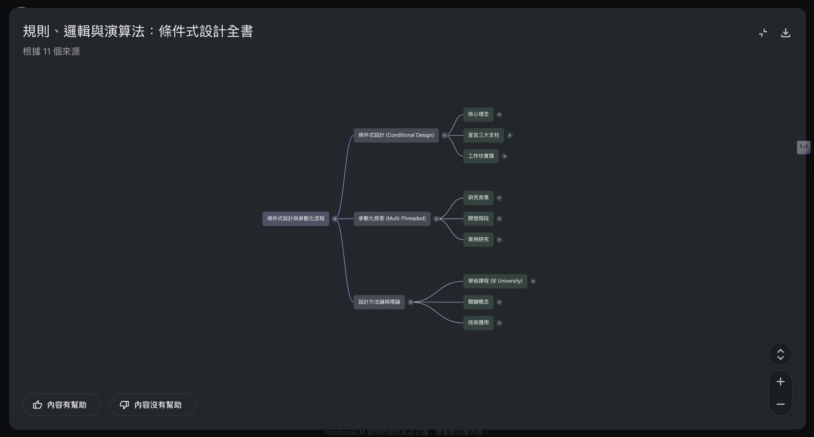
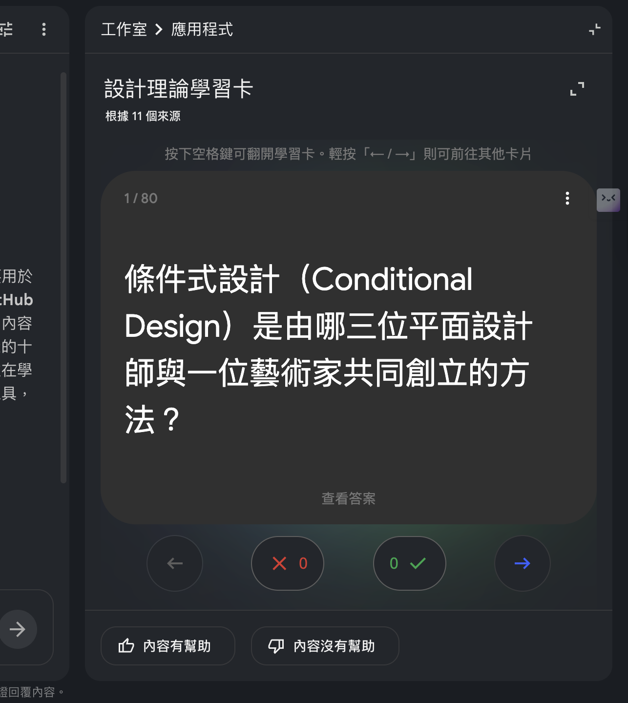
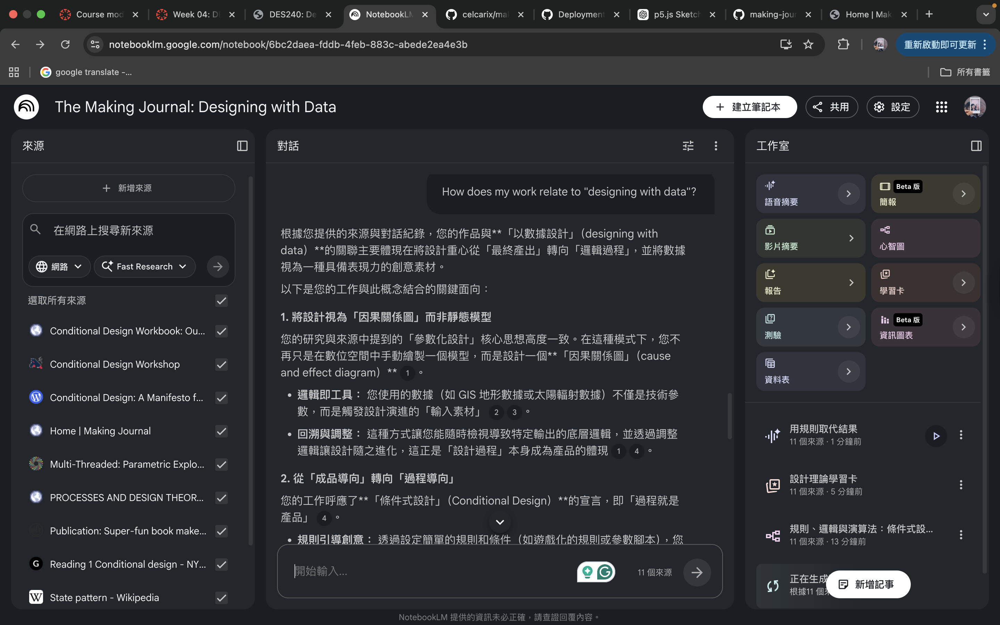

# Week 04

[← Back to Home](../index.md)

## Documentation 

The main task this vweek was creating Notebook LM and starting to organise course related resources. In this process, I began to reflect on the role of data in design and how to support creation through different sources. I added my Making Journal, works by some designers, and websites that interested me to the Notebook. These resources helped me understand "designing with data" from different perspectives, encompassing technical operations, concepts, and expressions. While searching for information, I paid attention to works that transformed data into visuals or stories. This made me relised that data is not just information, but also a material that can be designed and interpreted. 
The exercises this week allowed me to begin building my own databased and laid the foundation for future design development. I hope to futher explore how to transform this data into meaningful and personlly styled design works in the future.

## Images & Media

*Short sketches from Ollama and ChatGPT*

*Screen Recording of the short sketches(Ollama)*
<video controls width="100%">
  <source src="../assets/week-04/screen-recording5.mp4" type="video/mp4">
</video>

*Screen Recording of the short sketches(ChatGPT)*
<video controls width="100%">
  <source src="../assets/week-04/screen-recording6.mp4" type="video/mp4">
</video>

*Comparing responses of Ollama and ChatGPT*

*Exploring NotebookLM*

I explored NotebookLM starting with uploading my Github link, after that I use Conditional Design as a practice to explore NotebookLM. Through the process, I tried out few functions such as generating a mind map, study cards and the audio overview feature.

The audio overview highlighted connections between my experiments that I had not clearly recognised before, especially how my work consistently relates to "designing with data". However, some parts felt slightly generalised and did not fully capture my specific intentions or design decisions. Hearing my work as an audio narrative felt different from reading text, as it made my process sound more cohesive and structured, almost like a story rather than separate weekly tasks.
Using NotebookLM to analyse my own making journal was the most interesting part to me because it revealed patterns in my work I didn’t notice before. I am curious about how AI tools can be used to generate more personalised and expressive design outcomes in the future.

## AI Usage Statement

For this week's excerices, I compared Ollama and ChatGPT, by asking them the same questions and comparing the responses. Firstly, I started with asking them to generate a short sketch of p5.js, next, I tried to ask them the same question. Through the experiement, I found out that Ollama is a well-function tool if there's no connection. ChatGPT to me has a better explain and more advanced responses. Also, the audio overview was the most interesting part among all the exdperiment, the AI generated podcast-style would be a really helpful tool in the future. 