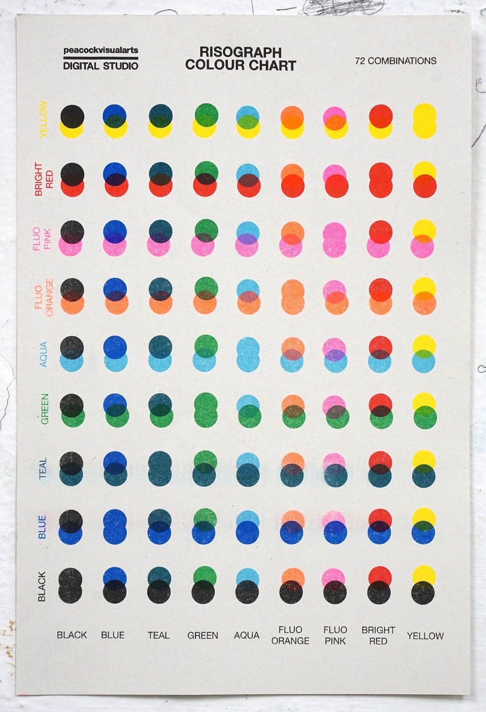
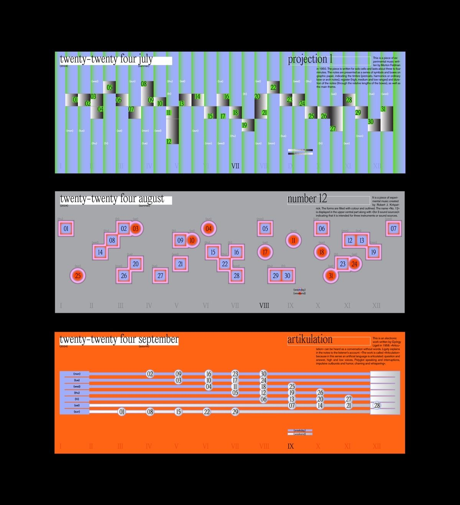
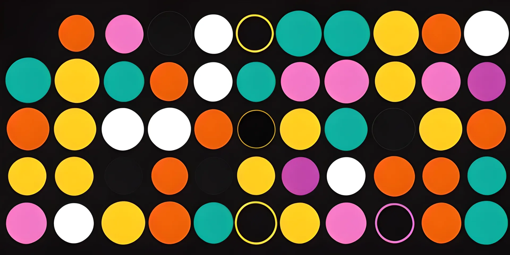
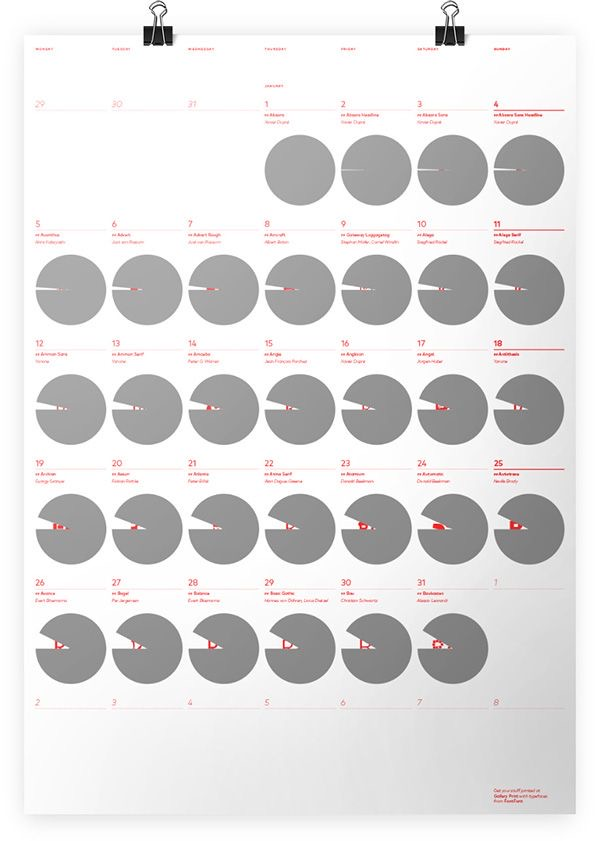
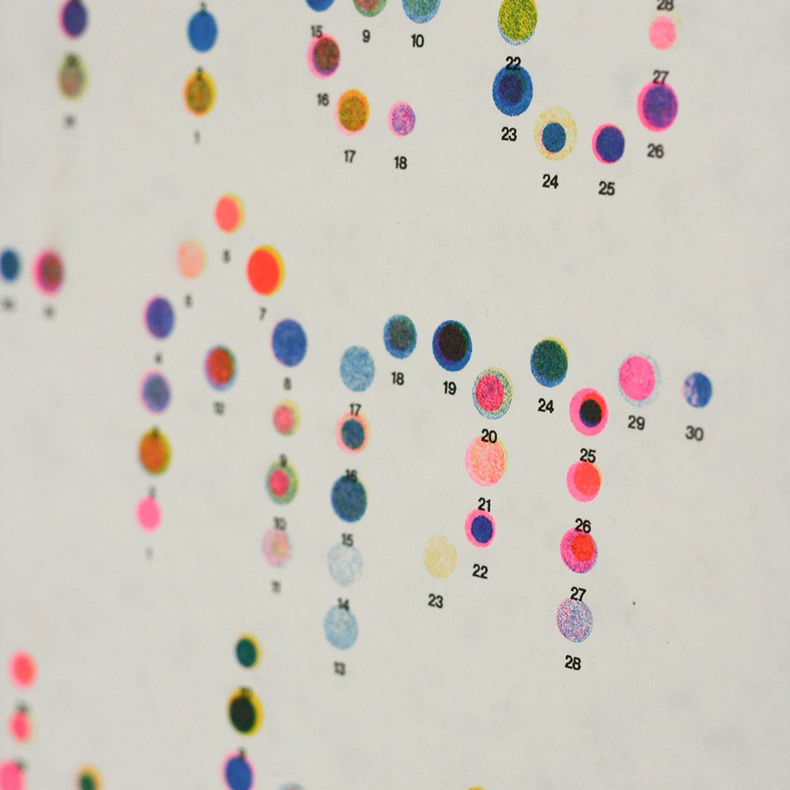
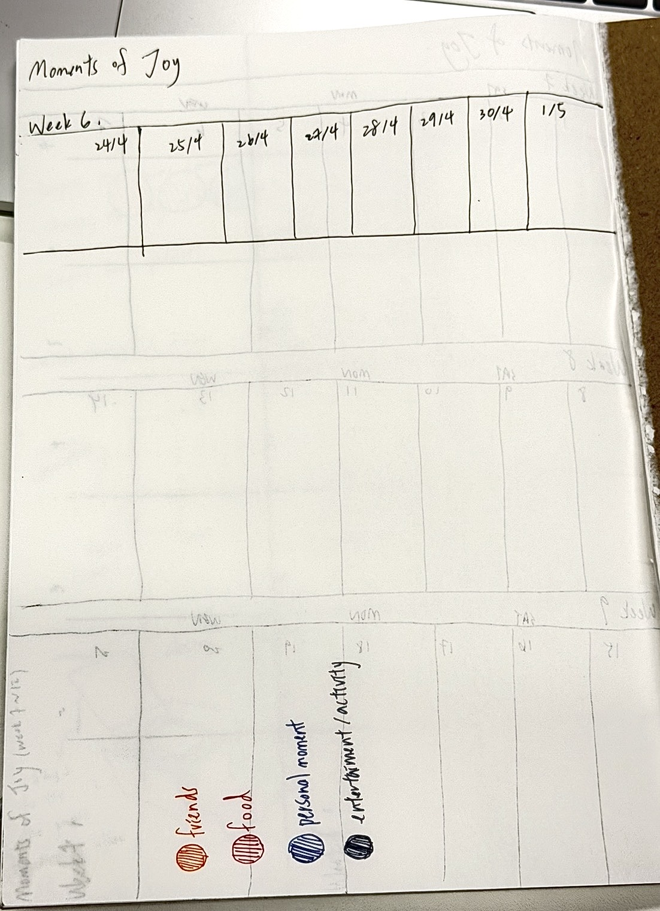
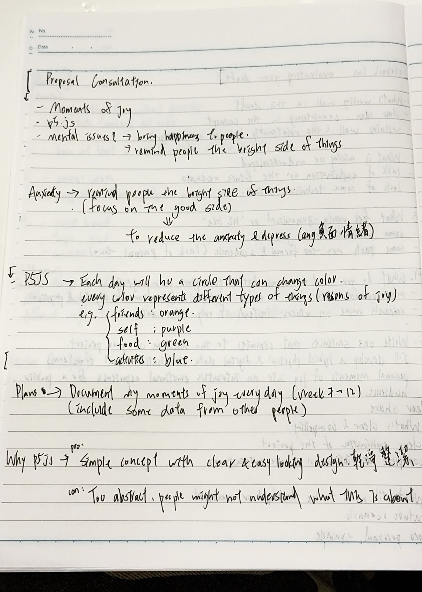
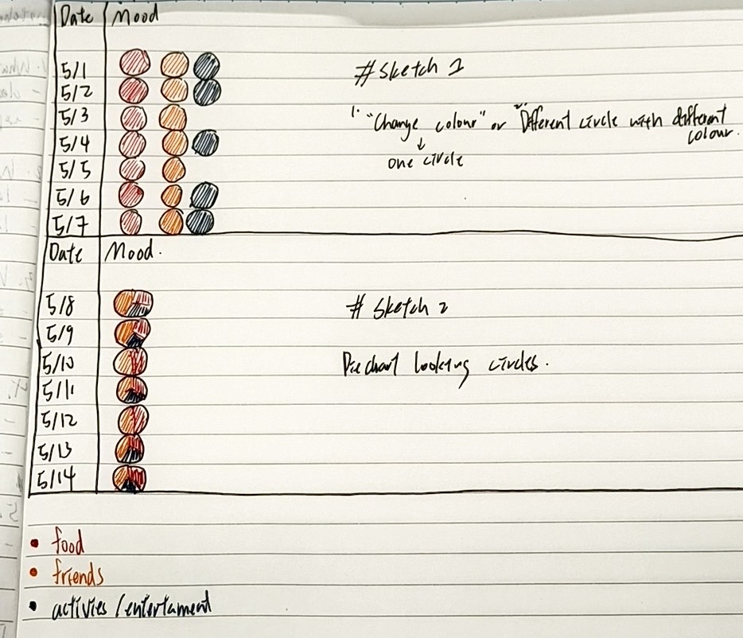
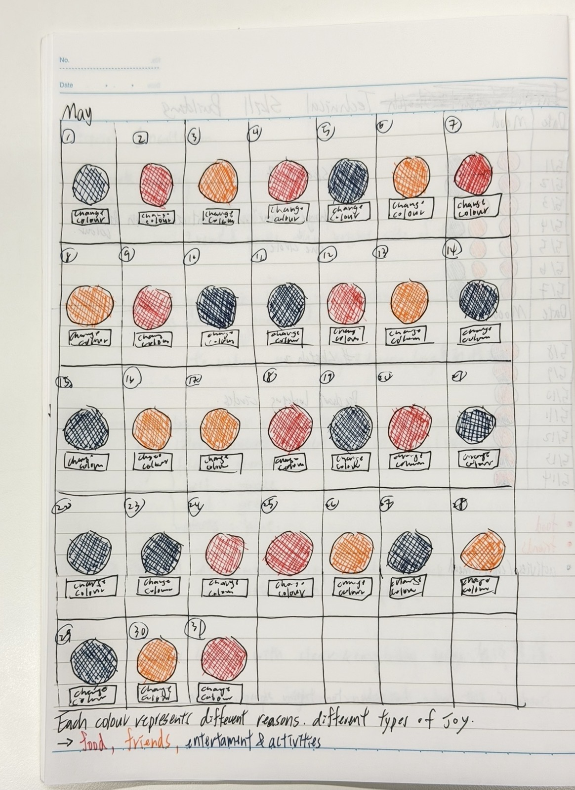
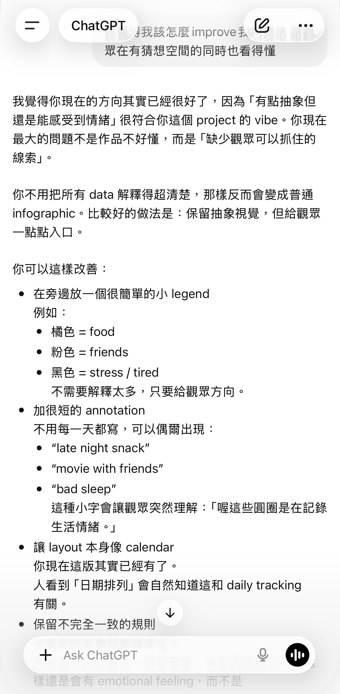

# Week 06

[← Back to Home](../index.md)

## Documentation 

**Data Exploration**

My data primarily comes from my own daily records. I started recording small events that made me happy, relaxed, or emotionally moved each day, such as meeting friends, eating my favorite food, seeing beautiful scenery, etc. I found that this data wasn't precise figures, but rather leaned towards emotions and personal feelings. Therefore, I began to think about how to present it in a more emotional way, rather than just simple charts.

**Project Planning and Skills Roadmap**

3.1 What do I need to make?

- I want to create an interactive data visualization using p5.js
- The work will utilize daily mood/emotion data to generate different colors, circles, and arrangements
- I want it to look like an abstract calendar, while also representing changes in mood and time

3.2 What do I need to learn?

- The basic interactive functions of p5.js
- Practice how to convert data into visual elements
- Learn color matching and layout
- Research how to present interactive data visualizations
- Practice how to make the work both aesthetically pleasing and readable

3.3 What are my next steps?

My next step is to continue developing my p5.js data visualisation by testing different layouts, colours, and circle-based graphics. I want to organise my daily mood and emotion data into a clearer structure so it can be translated more effectively into visual forms. I also plan to research more interactive and experimental data visualisation projects to better understand how designers combine personal data with visual storytelling. Through these references, I hope to improve the balance between aesthetics and readability in my own work. In addition, I need to continue learning the technical skills required for p5.js, especially how to generate shapes, organise data, and create interactive elements. My goal is to create a visual system that feels similar to a calendar while still expressing emotions in a more abstract and artistic way. I will begin creating small prototypes and testing different visual outcomes before deciding on a final direction for the project.

**Consultation reflection (Independent Study)**

During the consultation, I received some very helpful questions and feedback. One that particularly struck me was, "Why use p5.js to present this work?" This made me rethink my approach; perhaps my project could be presented in a more suitable way, not just limited to coding or interactive formats. After the discussion, I also realized that my current ideas are somewhat scattered, and many directions are not yet fully defined. For example, I'm still considering whether the work should lean more towards a calendar-style design or use circles and abstract images as the main visual elements. I think I need to spend more time on visual research and testing to clarify the overall direction. Furthermore, I realized that the current visual idea is a bit too abstract. Although I want to use circles and colors to represent emotional data, viewers may not be able to directly understand the meaning. Therefore, in the future, I might add some text descriptions, labels, or annotations to make the work easier for viewers to read and understand.

## Images & Media
*Visual Research and Precedent Study - Reference 1*

- I like this calendar-style design; it's very close to my daily recording concept
- The overall layout has a strong sense of unity and completeness, making the data very clear
- I want to borrow its grid layout and consistent visual structure

*Visual Research and Precedent Study - Reference 2*

- This is very similar to the p5.js sketch I envision
- I really like its graphic arrangement and simple yet systematic layout
- I hope to refer to its composition and geometric forms in the future

*Visual Research and Precedent Study - Reference 3*

- I like the experimental feel of this work; it immediately evokes data visualization
- Its image presentation is very creative and makes the data look more visually impactful
- I want to learn how it presents data in an abstract way

*Visual Research and Precedent Study - Reference 4*

- This design is also very close to my current vision of the p5.js visual outcome
- Although the forms are slightly different, the circles and arrangement are very similar to my ideas
- I especially like its color scheme and overall layout

*Visual Research and Precedent Study - Reference 5*

- I like its calendar-like feel while maintaining a clean and concise data presentation
- The way it uses circles is also very close to my current project direction
- I want to learn how it naturally combines time and graphics

*Visual Research and Precedent Study - Reference 6*

- This reference image is very similar to my current p5.js concept
- The combination of circles and numbers can directly represent dates and daily data
- I want to learn how it combines data, dates, and visual elements

*Project Planning and Skills Roadmap - 3.1 What do I need to make*

This is a brief illustration of what my final artefact might looks like. I want to create an interactive data visualization using p5.js. The visualization will use daily mood/emotion data to generate different colors, circles, and arrangements. I want it to look like an abstract calendar, while also representing changes in mood and time.

*Notes for proposal consultation*

Before the consultation, I took some notes to help me strengthen my thoughts and ideas during the process. I wrote down the reasons why I chose this theme for my project and the brief concept of the design I have in mind. 

*Technical Skill Building (Independent Study 2)*

I tried out two different ways to present my data collection. The difference between these two designs is the way they present; the one on top has more interaction, and the audience can click on the change button in order to view the mood of that day. The one on the bottom might bring less interaction to the audience, but at the same time, it looks cleaner and clearer, and the audience could quickly know what colours were included on that day. Personally, I preferred the first design. My next stage would be trying to improve the overall look and work on p5.js techniques. 

*Initial Concept Sketch (Independent Study 3)*

This is the most complete final draft so far. I've added more details to the original concept, such as more clearly depicting the calendar layout to make the overall structure clearer. I've also incorporated references found in visual research, referencing their arrangement, colors, and graphic designs. Additionally, I've added a short explanation at the bottom of the sketch, allowing viewers room for thought and interpretation without completely missing the message the work is trying to convey.

## AI Usage Statement

This week, ChatGPT helped me better understand the direction my project should take. Compared to the initial drafts, my concept is now more organised and complete. AI ​​helped me organise my thoughts and rethink the visual direction, layout, and how viewers would interpret my work. I also got feedback about balancing "leaving room for interpretation" with "making the work easily understandable." I received some helpful suggestions, such as adding short annotations or placing a small legend alongside the artwork to help viewers grasp the meaning of the colors and shapes while maintaining its abstract quality. I found AI ​​very helpful for my development in the early stages of the project. It helped me organise my thoughts more quickly, generate new ideas, and reflect on the current issues with my work.