# Week 07

[← Back to Home](../index.md)

## Documentation 

**Reflection Summary**

This week, I started with concept sketches exploring how to visualise my theme, “moments of joy,” through p5.js and calendar-style documentation. However, after viewing others’ works and receiving post-it feedback during class, I began to rethink my concept and presentation method. I realised that my original idea felt too simple and diary-like, and the visualisation was not creative or emotionally engaging enough. 

One of the main challenges was translating abstract emotions and personal data into a more meaningful physical form. Because of this, I decided to shift away from p5.js and start exploring a handmade pop-up / 3D book format instead. I wanted the project to feel more interactive, physical, and visually expressive. Through this process, I learned that looking at others’ work and exchanging feedback can become an important source of inspiration. Seeing different approaches helped me reconsider my own project direction and pushed me to develop a stronger concept.

**Project Development**

At the moment, I have developed an early direction and structure for the project, but the final concept and presentation are still not fully resolved. I have started sketching ideas for the 3D book format and thinking about how emotions and data can be translated into physical interactions and structures. My next step is to continue developing prototypes, experiment with different folding and interactive mechanisms, and gather more feedback from others in order to refine the concept and presentation style further.## Images & Media

*15 Minute Concept Sketch & Feedback*
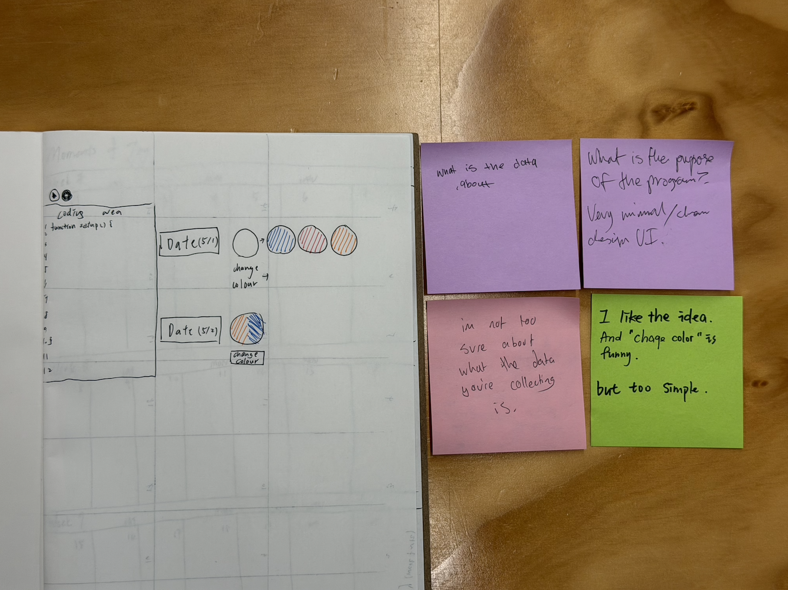
My first idea for this project is to use p5.js to demonstrate the documentation of my theme, "moments of joy." After I received the post-it responses and viewed others' ideas, I realised that my idea wasn't the best, it's not as creative, and it doesn't bring people to the idea of moments of joy as well. Also, the idea of p5.js is abstract, so the viewers might not understand what this project is about.  

*The initial idea I sketch out(calendar style)*
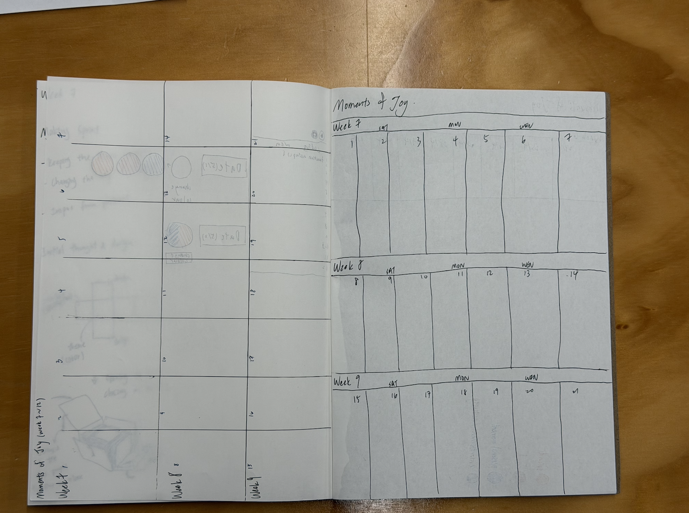
This was also the first idea I developed, with the same problem as the first one, it doesn't perfectly demonstrate the idea. 

*Post-It Responses I gave out*
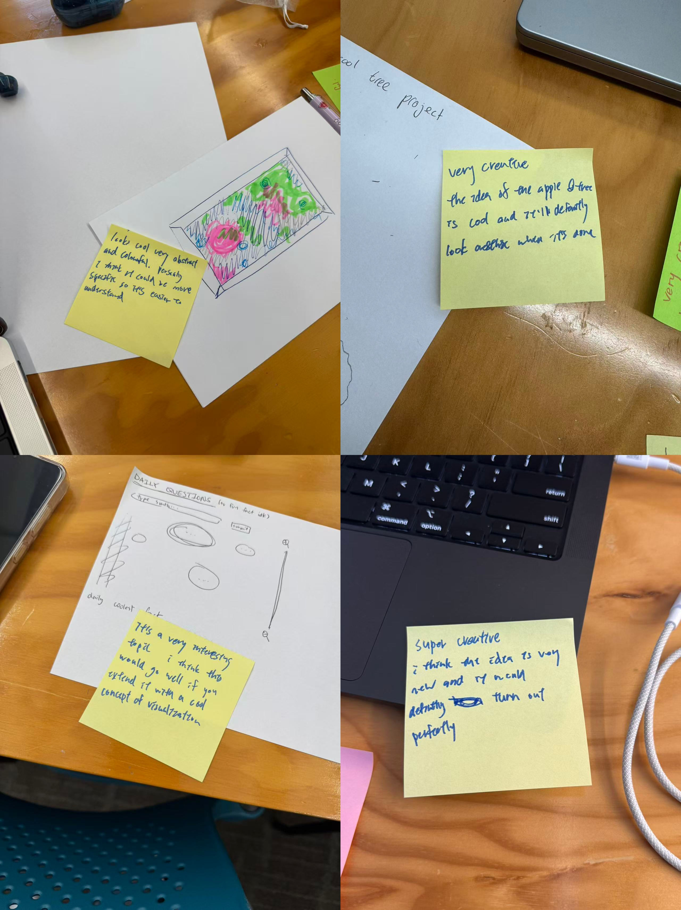
I was inspired by viewing others' initial work. I really liked some ideas; one of the most creative ideas was the apple tree idea, which has made me rethink creating the idea for my project.

*Returning to my sketch- Making Sprint*
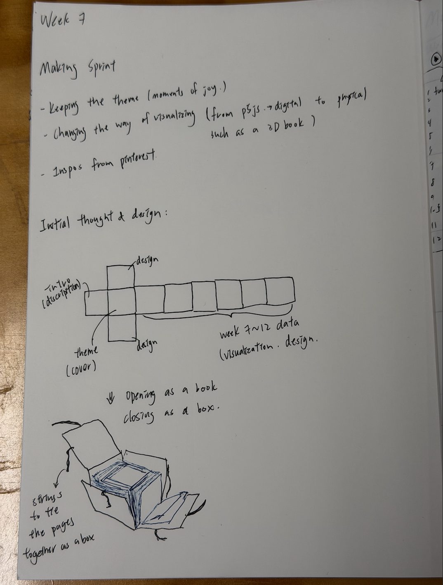
After the showcase, I decided to change the way of presenting from p5.js to a concept of a 3D book. I wrote and drew down the new ideas and started thinking of how I want to present the concept.

*"What If" Variations*
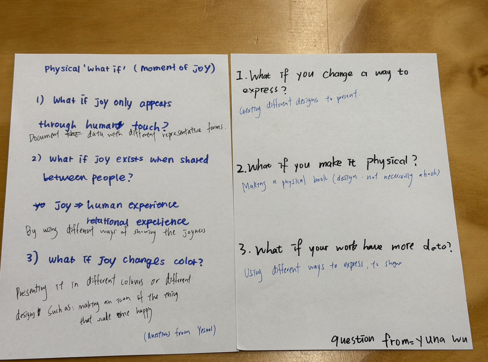
I received and gave out some "what if" scenarios in order to identify some issues that we might face, and maybe a way to improve our work. 

 *Project Development & Skill Building*
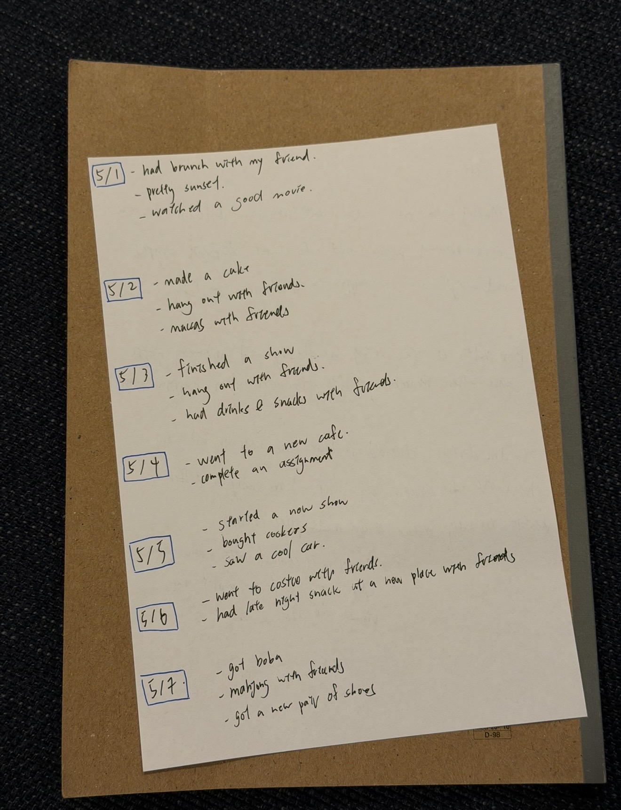
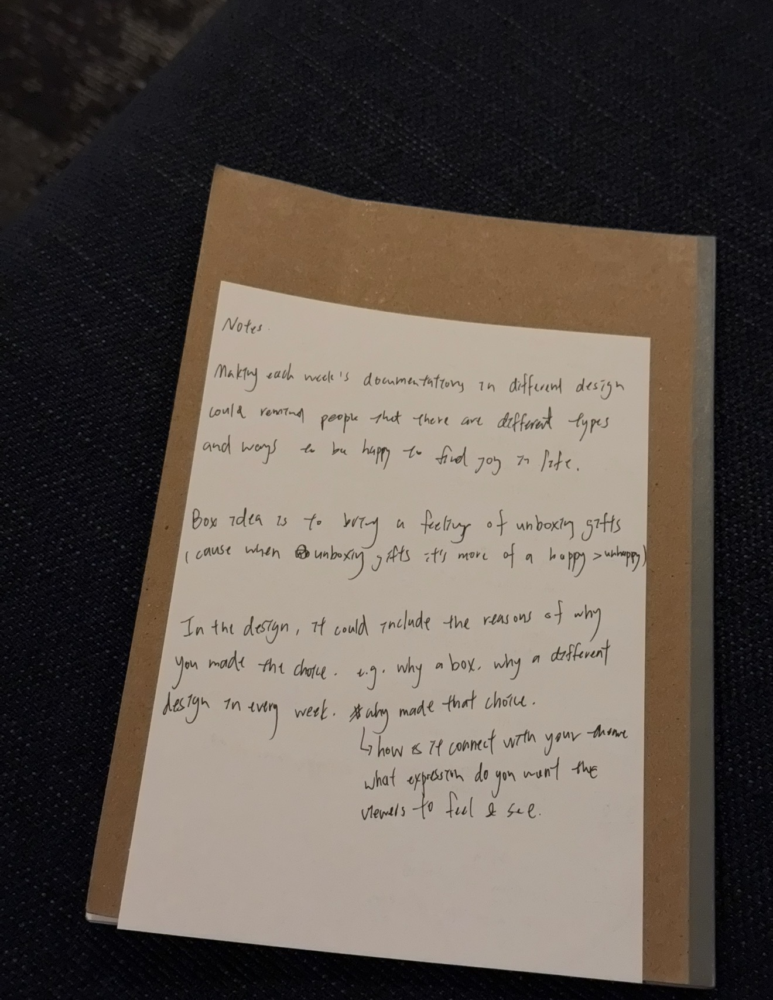
Documented the moments of joy for week 7. I also took some notes on week 7's class, which helped me with development when I'm unsure about an idea. Especially at the beginning of the project, it's important to have something to guide. 

*Independent study-progress report ppt*
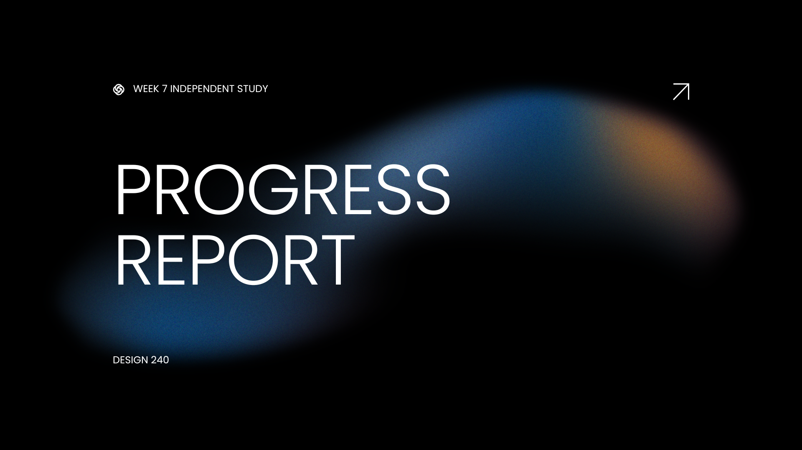
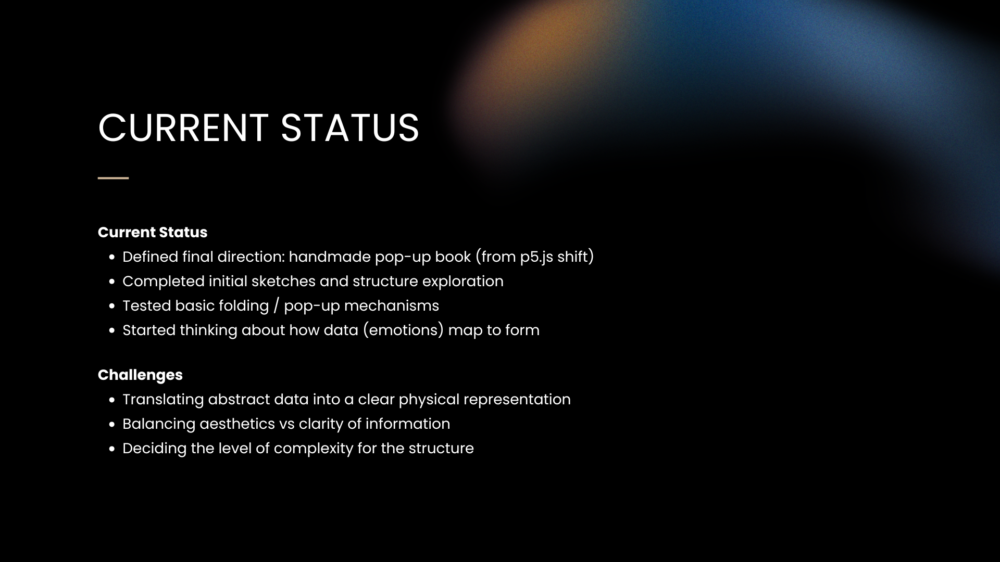
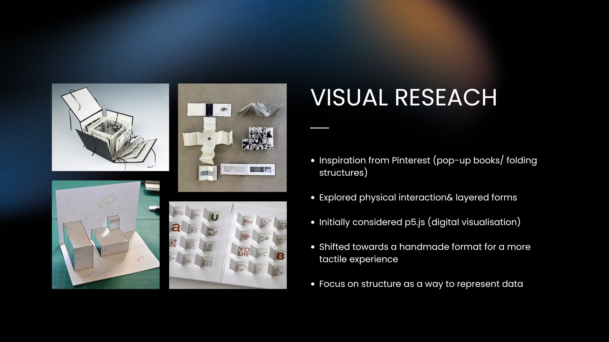
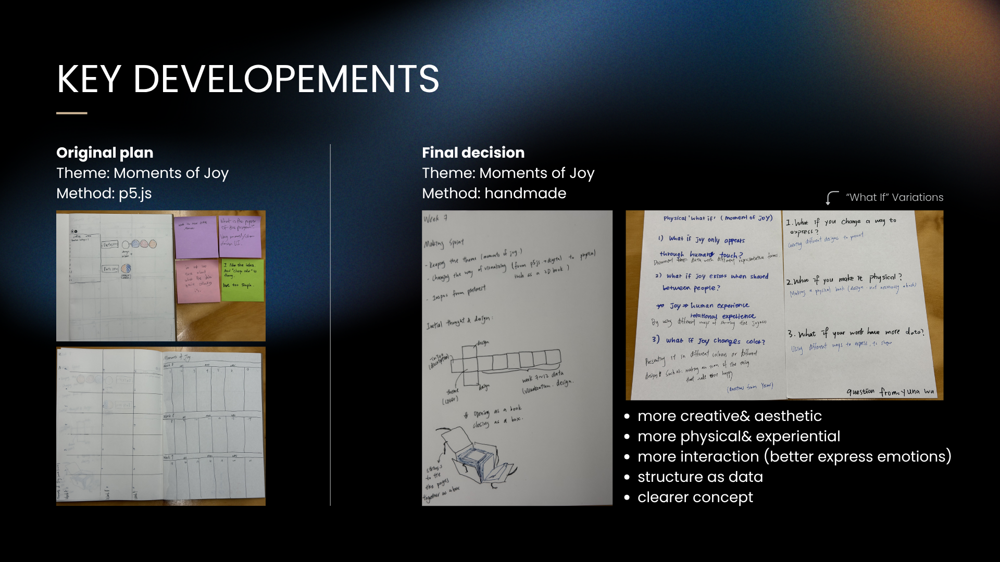
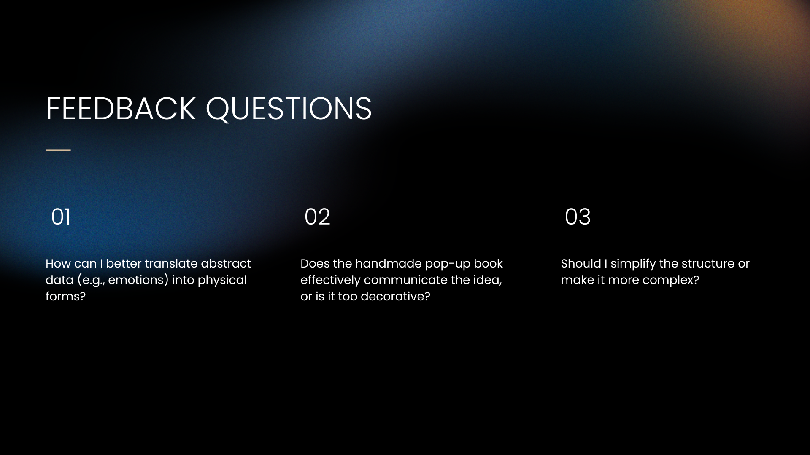
This progress report summarises my current project direction, visual research, and key developments from week 7. It also includes feedback questions to help futher develop the concept and physical interaction of the work. 

## AI Usage Statement

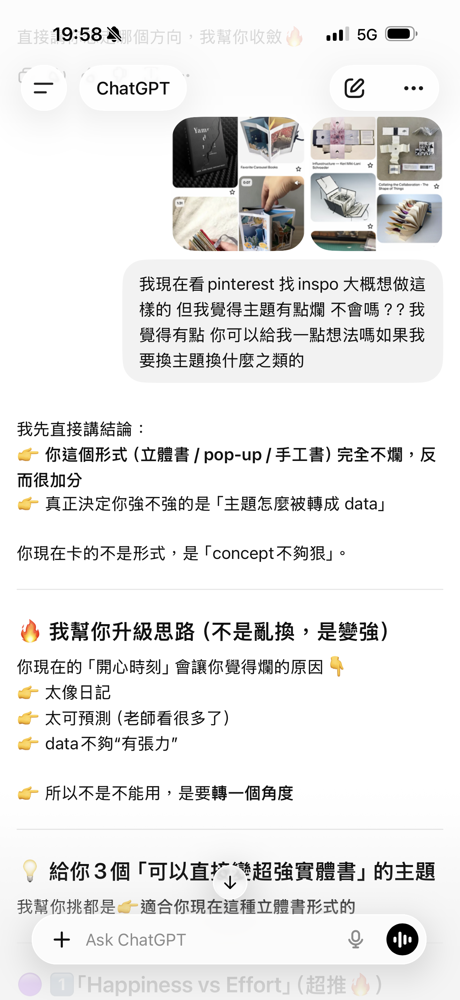
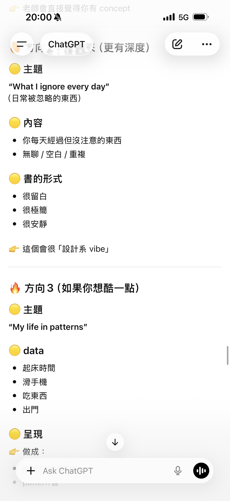

I used ChatGPT to reflect on my project direction and concept development. It provides feedback on my idea, suggesting that the concept needed to be stronger and less dairy-like, as the data did not feel visually or emotionally impactful enough. It also helped me think about changing my theme and visualization method from p5.js to a handmade pop-up book format.