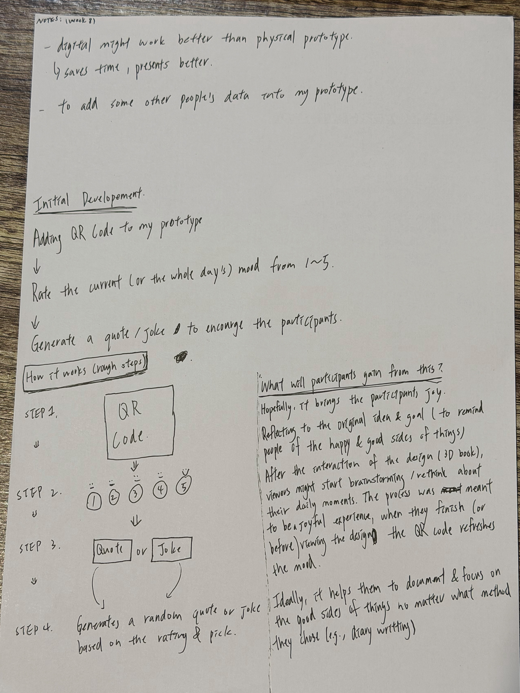
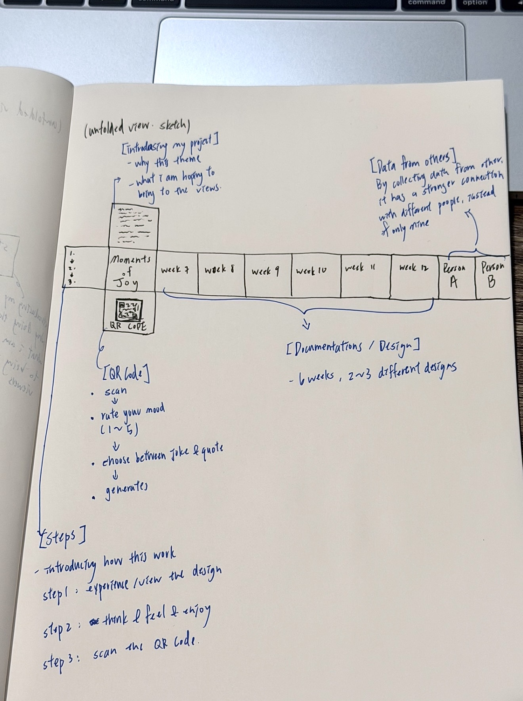
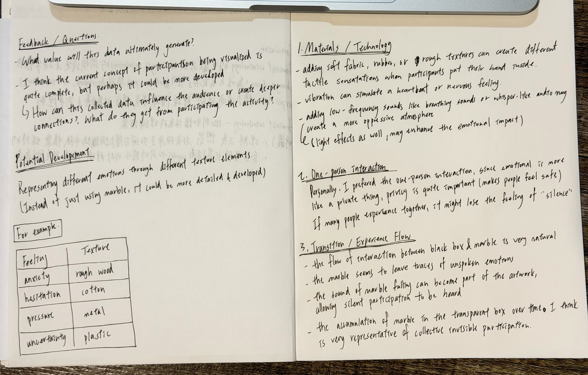
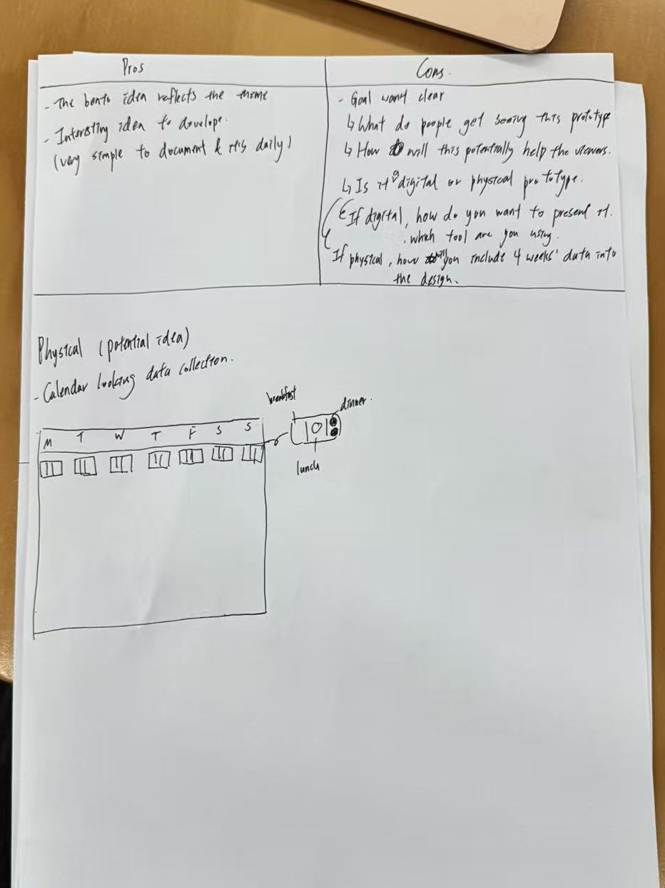
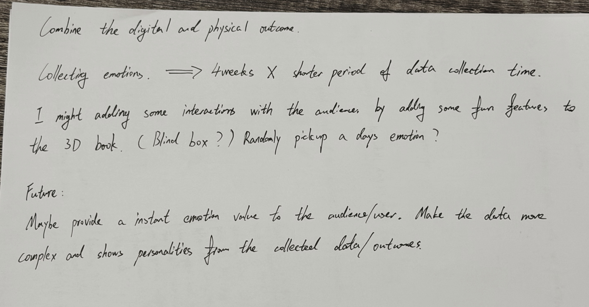
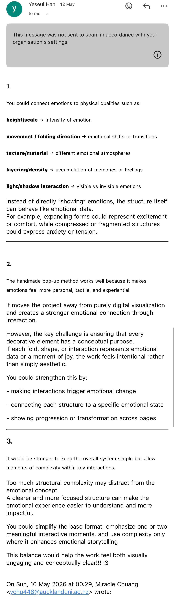
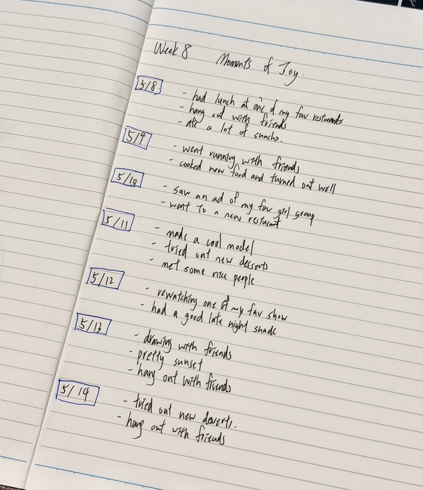

# Week 08

[← Back to Home](../index.md)

## Documentation 

**Reflection Summary**

This week, through progress reports and classroom feedback, I began to rethink my project direction. Originally, my project focused on presenting the theme of "moments of joy" using p5.js and a physical pop-up book. However, after receiving feedback, I realised that while my current work had a certain visual direction, the overall concept and audience interaction were still incomplete. Some feedback mentioned that the data and emotional connection in the work weren't strong enough, and it lacked a sense of genuine audience participation.
This feedback made me think that my work shouldn't just be a simple presentation of my personal emotions and daily records. Still, it should also create an emotional connection for the audience. I also reconsidered the relationship between physical and digital, and decided to start developing a combination of both, rather than focusing solely on a single form of visual outcome.  Exchanging feedback with other students this week taught me a variety of presentation methods and approaches to concept development. I found that watching other people's projects and discussing ideas helped me see my own work's current problems more clearly and how to improve it in the future.

One of the most important decisions I made after receiving feedback was to introduce a QR code interaction into the project. Several classmates mentioned that my original concept lacked audience participation and emotional engagement, which made me rethink how viewers could become more involved in the experience. In this development, I've started designing a QR code interaction. After viewing the artwork, viewers can scan the QR code to access an interactive page and rate their mood for the day (from 1 to 5). After rating, the system will provide a quote or a short joke based on the different mood scores, aiming to bring viewers a more positive and relaxed emotional experience. I decided to add this interaction because I wanted the work to create a small moment of positivity and emotional connection, rather than only presenting visual information. This development also changed my understanding of the relationship between physical and digital design. I realised that combining both formats could make the experience feel more interactive, personal, and memorable for the audience.

**Project Development**

Based on feedback received this week, I've begun developing a new interactive direction. I've decided to retain the original pop-up book/3D book format but incorporate elements of digital interaction, hoping to increase audience participation and emotional engagement.

In this development, I've started designing a QR code interaction. After viewing the artwork, viewers can scan the QR code to access an interactive page and rate their mood for the day (from 1 to 5). After rating, the system will provide a quote or a short joke based on the different mood scores, aiming to bring viewers a more positive and relaxed emotional experience.

I hope this interaction will continue the concept of "moments of joy" that the artwork originally expressed and respond to the anxiety that modern people easily experience due to social media and daily stress. I want this small interaction to allow viewers to develop a deeper emotional connection after viewing the artwork, rather than simply watching a visual outcome.

Currently, I'm still exploring the most suitable digital platforms and technologies, such as interactive websites or other QR code systems. I also continue to test how physical and digital can be combined more naturally, and think about how to make the audience experience more complete and engaging.

## Images & Media

*Progress Report - Notes& Potential Development*
 

這個照片要換掉!!!!!!!!!!!?????????

*Critical Designing Propositions - Feedback I gave out*

I gave feedback and critical suggestions to another student’s project by analysing the strengths and weaknesses of their current direction. I considered how their concept could be developed further through material choices, interaction, and different forms of visualisation. I also responded to the feedback questions included in their progress report presentation and suggested possible improvements and alternative approaches that could make the project more engaging and meaningful.

*Critical Designing Propositions - Feedback I recived*

I received feedback and suggestions from other classmates regarding my project direction. They suggested that I consider combining digital and physical presentation methods to increase audience interactivity, and to make the emotions and data in the work more connected, or to create a more engaging interactive experience by adding more relatable interactive elements. This feedback helped me rethink how the audience would experience the work.

*Moments of Joy documentatiton*

Through week 8's documentation, I've been keeping a record of small events in my daily life that make me happy or relaxed to observe the sources of my emotions more clearly, and what small things bring positive feelings.

## AI Usage Statement

*Document any use of AI tools under an AI Usage Statement heading. Explain which tools you used and describe how you used them. Reference any AI-generated content (see [QuickCite](https://auckland.libguides.com/referencing-generative-ai-tools) for guidance).*
