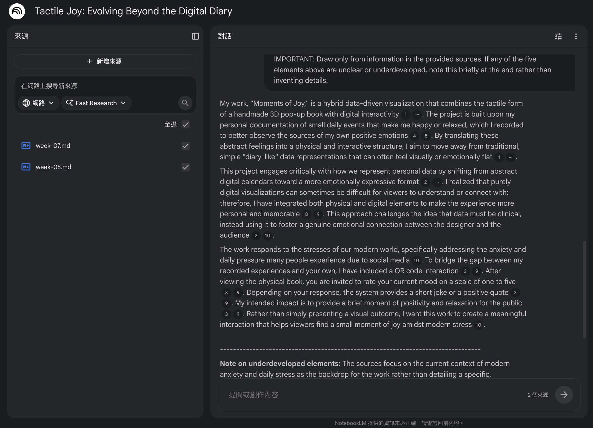
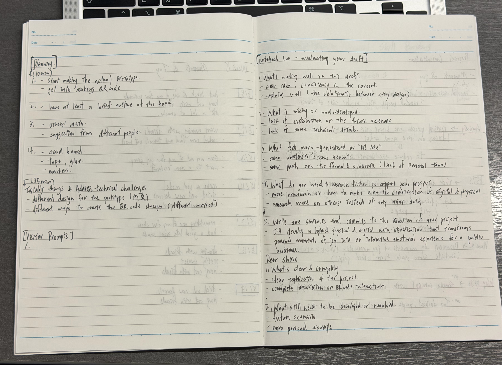
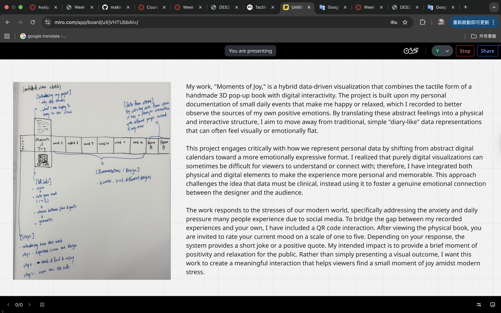

# Week 09

[← Back to Home](../index.md)

## Documentation 

*Include your documentation for the week. Devise your own structure of headings relevant to the required tasks and your process.*

## Images & Media

*Case study*
（以上還沒放圖）

//

*NotebookLM - Drafting*
 

*NotebookLM - Evaluation*
 

*NotebookLM - Peer Share*
(以上還沒放圖)

*Making Sprint*
（以上還沒放圖） 

/. 

*Round Robin Rapid Reactions*
（以上還沒放圖）

*QR Code - Mood Check 1*
(Screen Recordings)

<video controls width="100%">
  <source src="../assets/week-09/screen-recording1.mp4" type="video/mp4">
</video>
This was the initial prototype version, with only a single page and fixed quotes and jokes. While the functionality was still basic, it was a good starting point for testing the overall flow of QR code interaction.

*QR Code - Mood Check 2*
(Screen Recordings)

<video controls width="100%">
  <source src="../assets/week-09/screen-recording2.mp4" type="video/mp4">
</video>
This version added page transitions, making the overall interactivity more complete than the first version. However, the quotes and jokes still only had fixed content, so the interactive experience wasn't very engaging, and there was a lack of motivation for repeated participation.

*QR Code - Mood Check 3*
(Screen Recordings)

<video controls width="100%">
  <source src="../assets/week-09/screen-recording3.mp4" type="video/mp4">
</video>
This is the most complete version to date. I added multiple page transitions, making the interface clearer and more layered, and increasing audience engagement. At the same time, quotes and jokes are randomly generated, ensuring different results for each interaction, making the overall experience more natural and fun.

## AI Usage Statement

*Document any use of AI tools under an AI Usage Statement heading. Explain which tools you used and describe how you used them. Reference any AI-generated content (see [QuickCite](https://auckland.libguides.com/referencing-generative-ai-tools) for guidance).*
