# Week 09

[← Back to Home](../index.md)

## Documentation 

This week was primarily spent further refining and confirming my project direction, and beginning to translate my ideas into more concrete forms. Through NotebookLM's drafting and evaluation, I gained a clearer understanding of the overall structure of the project statement, its current strengths, and areas requiring modification and improvement. I also corrected major issues in the original QR code interaction, making the overall functionality and interaction methods clearer, although some minor details still need further adjustment and refinement. Through peer feedback and round-robin discussions, I gained a better understanding of which parts were clearly expressed and which areas needed further development. In addition, I sought out new reference images, which helped me better understand the physical book format, layout arrangement, and the possibilities of physical books in terms of interaction and visual presentation, giving me a clearer idea of ​​my next production direction. During the sprint making process, I also began to transform my original notes into physical book layout drafts, further considering the possibilities of content arrangement and physical format. Overall, this week helped me gradually move from conceptual development to actual production, and also gave me a clearer understanding of the project direction for the next stage.

## Images & Media
*Case study*
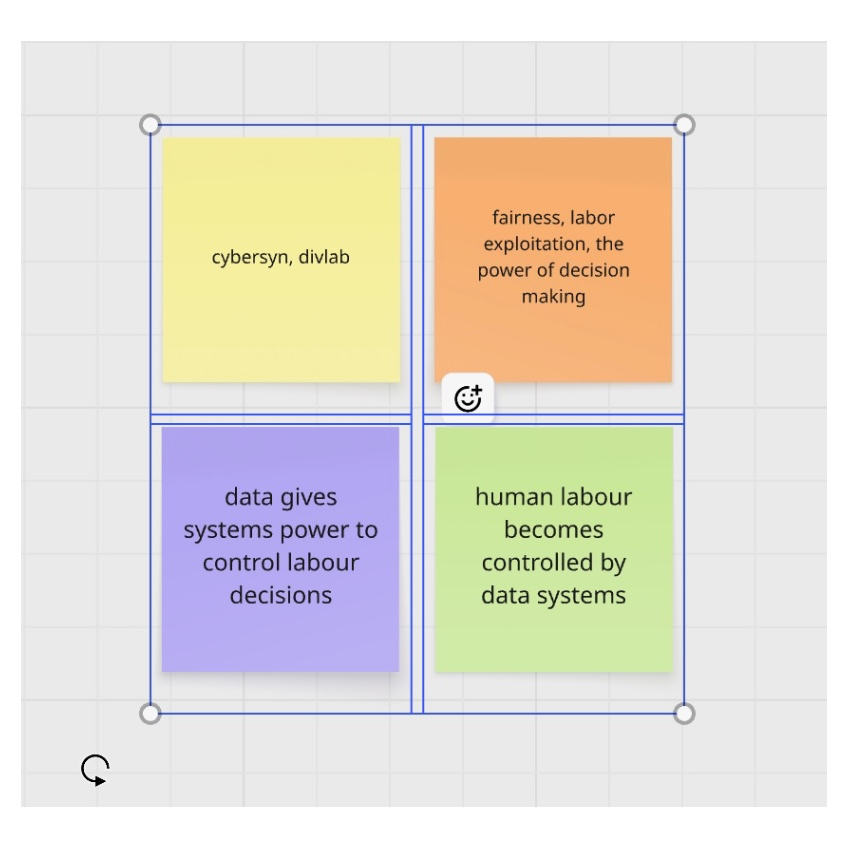 
This case study made me realize that data and algorithms are not just used to analyse information, they can also directly influence human work allocation and decision-making. By imagining a future where labor is managed by a system, the work made me consider the potential problems between power and fairness when data holds decision-making power. This case study also reminded me that behind seemingly objective systems, issues of control, responsibility, and labor rights still exist.

*NotebookLM - Drafting*
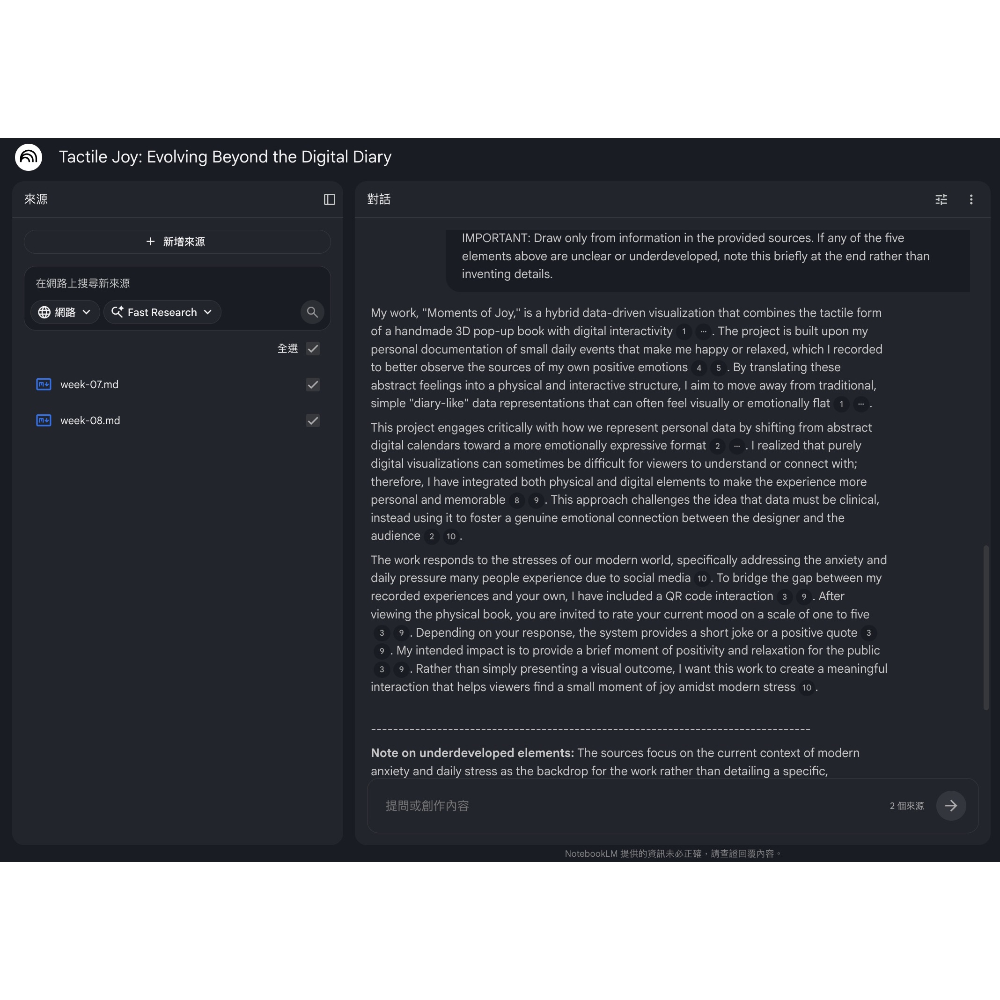 
While using NotebookLM's draft project statement, I found it very helpful in organizing my previously scattered ideas, making the entire project sound more structured, and also helping me to confirm my direction. However, I also noticed that some sentences were somewhat AI-like and the content was too broad, so I still need to revise them myself to make them more specific and more in line with the project I actually want to do.

*NotebookLM - Evaluation*
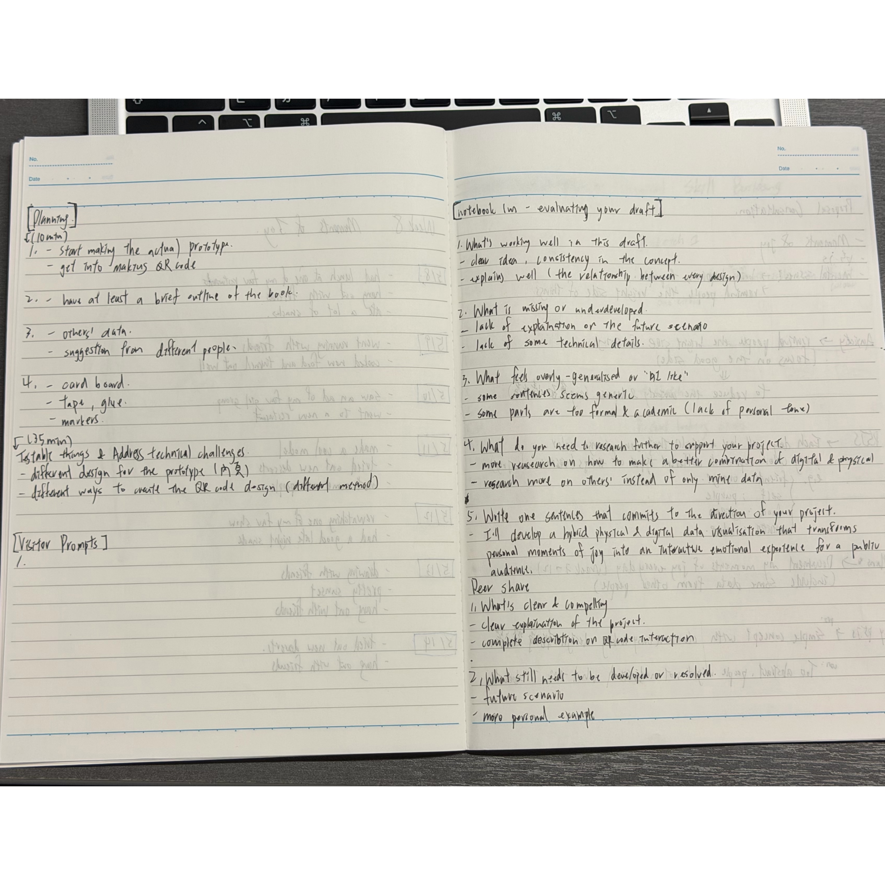 
Using NotebookLM helped me organise my project statement into a clearer and more structured format, making the overall concept, method, and intended impact easier to understand. It was useful in helping me connect ideas that previously felt scattered and confirming the general direction of my project. However, after reading through the draft, I realised that some parts were still underdeveloped, especially the physical making process, the user experience, and the connection between the handmade book and QR interaction, which need more specific detail. I also noticed that some sentences felt too formal, overly broad, and somewhat AI-like, as they did not fully reflect my own writing voice or the specific qualities of my project. This made me realise that while AI can help organise ideas, relying on it too much might influence my own thinking and writing style, so I still need to revise critically and make sure the final statement feels more personal and specific. Moving forward, I need to research further into physical pop-up structures, QR interaction, and better ways to communicate emotional data through interaction. I will continue developing a handmade interactive book that combines physical touch and digital response to create small moments of joy.

*NotebookLM - Peer Share*
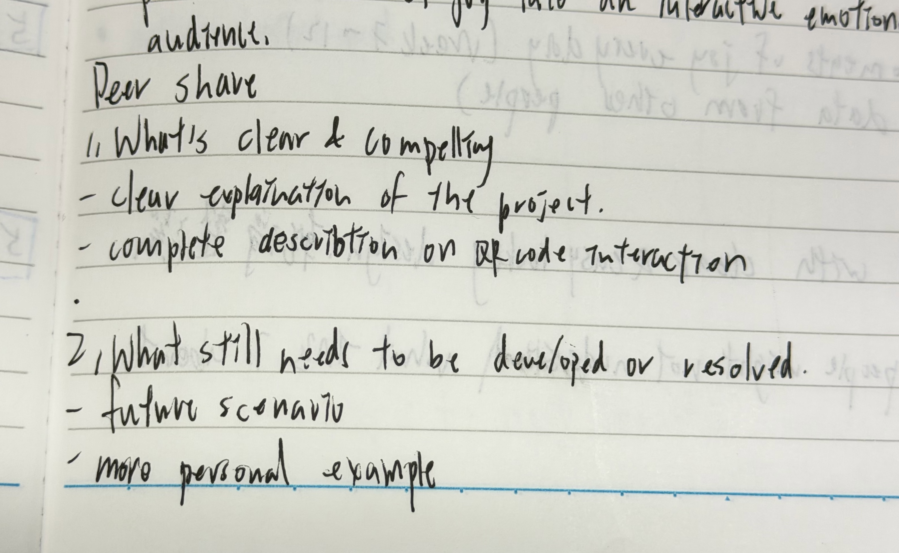 
During the peer share, my classmate responded to the NotebookLM-generated draft by saying that the overall explanation of the project was clear and compelling, especially the way the project concept and QR code interaction were described. This showed me that the draft was effective in communicating the main idea of the project. However, they also pointed out that some parts still need further development, particularly the future scenario and the inclusion of more personal examples. This feedback helped me realise that although the draft is structured and understandable, it still needs to feel more specific, personal, and connected to my own voice rather than staying too general.

*Making Sprint*
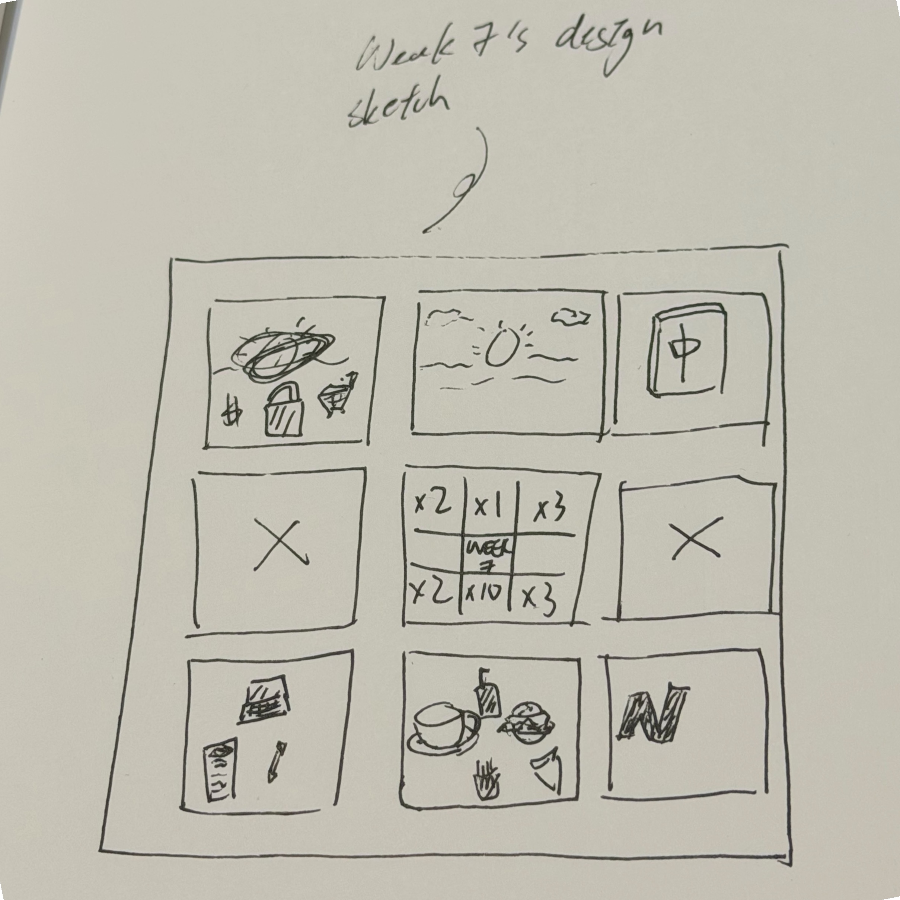
For the making sprint, I used my Week 7 documentation as a starting point to sketch a possible physical book layout. Instead of focusing only on digital records, I explored how weekly moments and personal data could be organised visually into a page-based physical format. This sketch helped me test the arrangement of content, the balance between different sections, and how information might be structured across a handmade book page. By translating my earlier documentation into a physical layout draft, I was able to begin thinking more practically about how the book could function as a tactile and interactive object in the next stage of development.

*Round Robin Rapid Reactions*
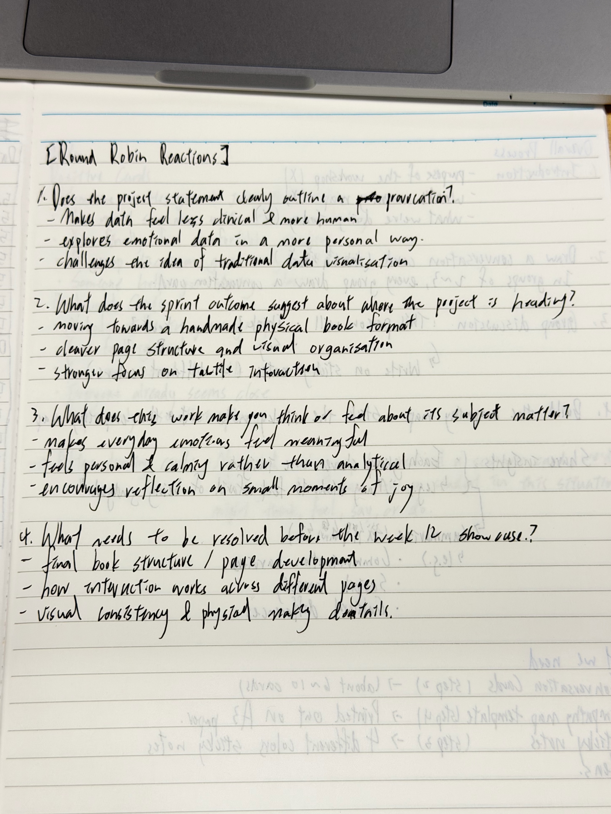
During the Round Robin Rapid Reactions, feedback suggested that my project statement clearly presents a provocation by challenging traditional ways of visualising data and exploring emotional data in a more personal and tactile format. The making sprint outcome also showed that the project is moving more clearly towards a handmade physical book with stronger attention to page structure and interaction. Viewers responded to the project as something reflective and calming, as it focuses on everyday emotions and small moments of joy rather than analytical data alone. However, feedback also highlighted that several aspects still need to be resolved before the Week 12 showcase, particularly the final page development, interaction design, and overall physical consistency of the handmade book.

---
**Independent Study**

*Project Development: QR Code - Mood Check 1 (Screen Recordings)*

<video controls width="100%">
  <source src="../assets/week-09/screen-recording1.mp4" type="video/mp4">
</video>
This was the initial prototype version, with only a single page and fixed quotes and jokes. While the functionality was still basic, it was a good starting point for testing the overall flow of QR code interaction.

*Project Development: QR Code - Mood Check 2 (Screen Recordings)*

<video controls width="100%">
  <source src="../assets/week-09/screen-recording2.mp4" type="video/mp4">
</video>
This version added page transitions, making the overall interactivity more complete than the first version. However, the quotes and jokes still only had fixed content, so the interactive experience wasn't very engaging, and there was a lack of motivation for repeated participation.

*Project Development: QR Code - Mood Check 3 (Screen Recordings)*

<video controls width="100%">
  <source src="../assets/week-09/screen-recording3.mp4" type="video/mp4">
</video>
This is the most complete version to date. I added multiple page transitions, making the interface clearer and more layered, and increasing audience engagement. At the same time, quotes and jokes are randomly generated, ensuring different results for each interaction, making the overall experience more natural and fun.

*Pop-up Book Current Progress*
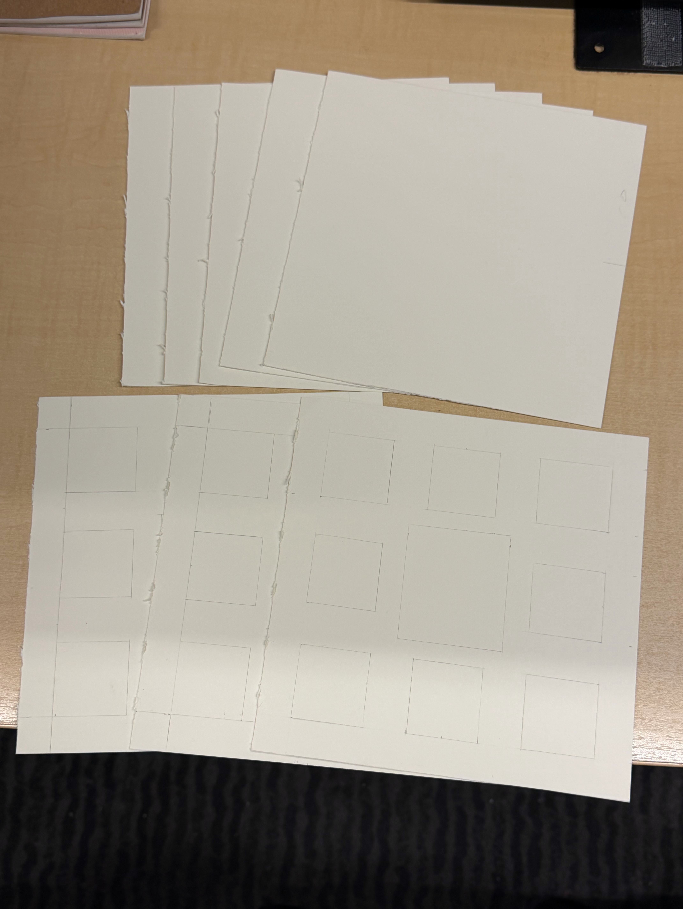 
My pop-up book is currently in the initial production stage. I've done basic measurements and paper cutting, and started testing the page layout and overall arrangement, considering how different content will be presented in the physical book. Although it's still in the early stages of a prototype, and many pop-up structures and details are not yet finalized, it has at least moved from the initial sketches and planning to actual production. This process has also helped me see the possibilities of the physical format more clearly, as well as areas that need further development.

*Moments of Joy documentatiton*
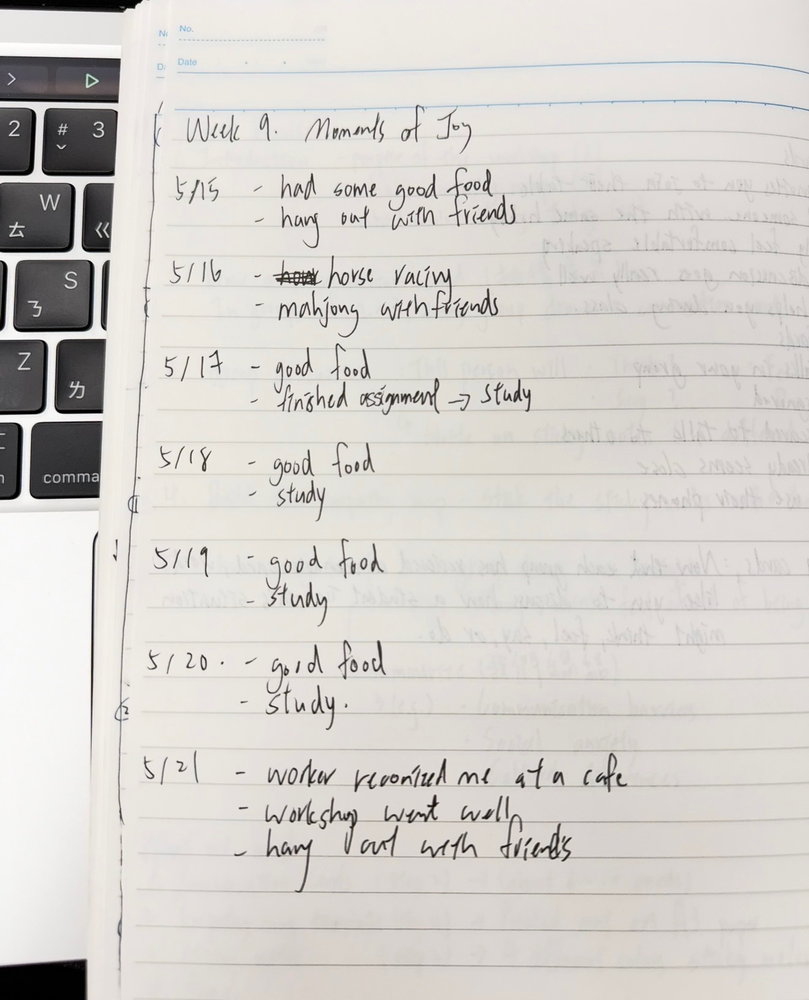 
This week's Moments of Joy documentation is relatively simple compared to previous weeks, with fewer particularly interesting or significant events. It's more like recording ordinary little moments. While it appears quieter visually and less rich in content than the previous weeks, it made me realize that joy doesn't always come from grand events; sometimes it can be just ordinary, everyday moments. This way of recording is a new kind of documentation for me, making me pay more attention to emotions and everyday life itself, and helping me better understand my project concept.

*Independent Study - Progress Report*
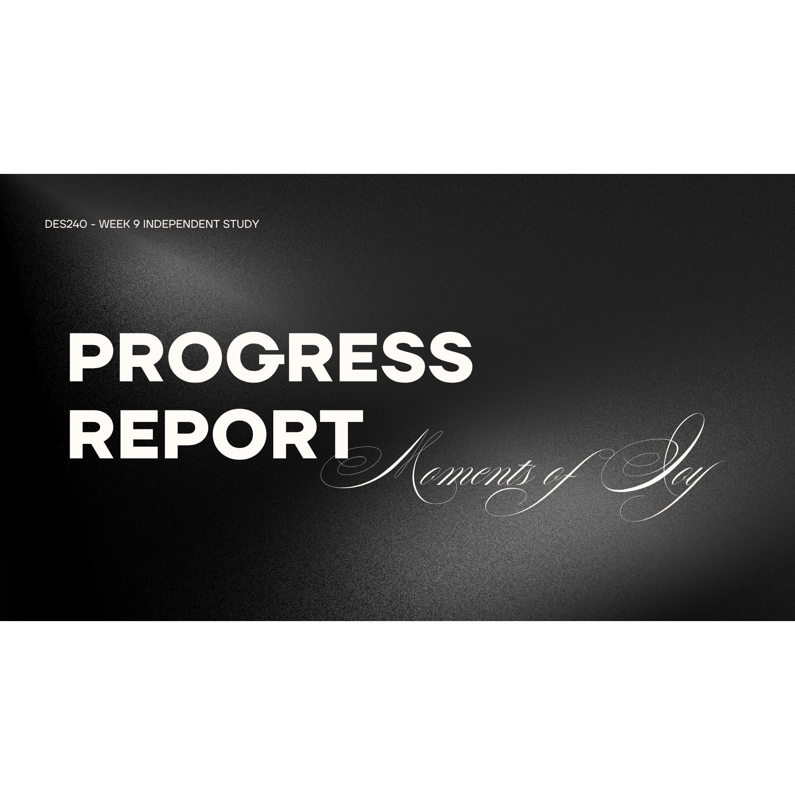 

<video controls width="100%">
  <source src="../assets/week-09/screen-recording4.mp4" type="video/mp4">
</video>

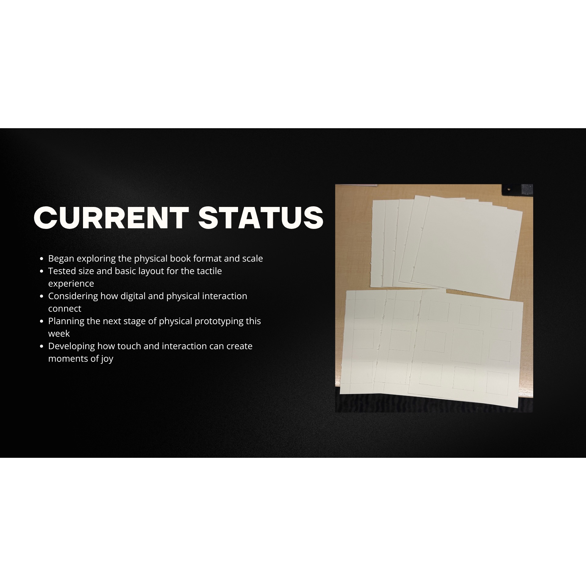 
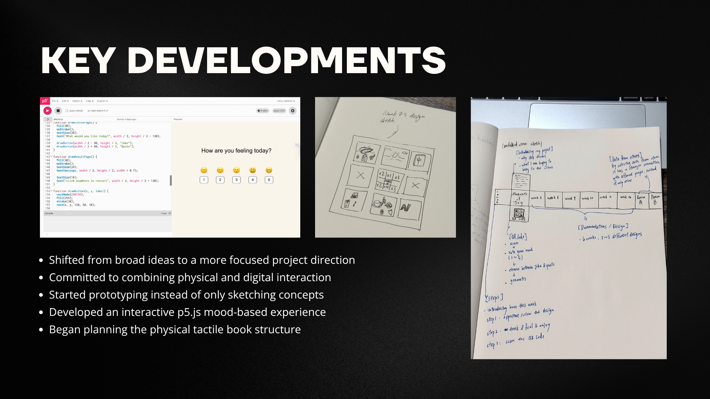 
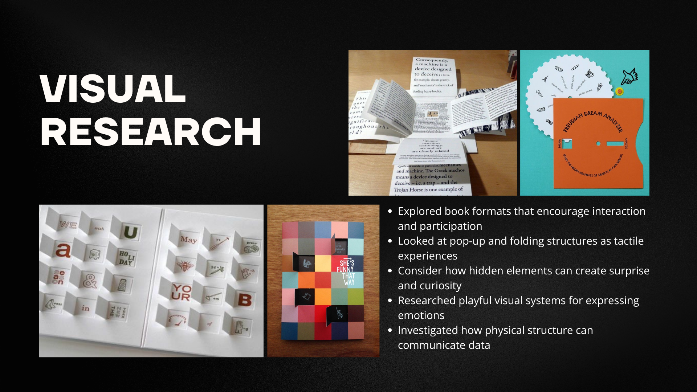 
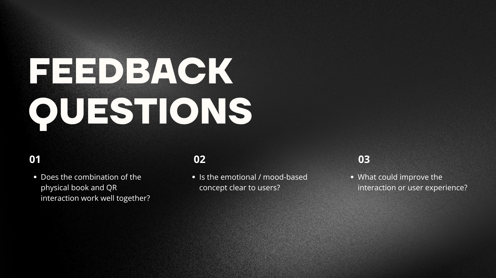 

This progress report primarily serves to organize my current project's progress, allowing me to re-examine my journey from the initial concept development to the current stage of actual production. Through this process, I can more clearly see the parts that have been completed, the areas that still need modification, and the issues that should be prioritized next. At the same time, this report also helps me to organize feedback, research, and prototype development more systematically, giving me a clearer understanding of the project's overall direction and progress.

## AI Usage Statement
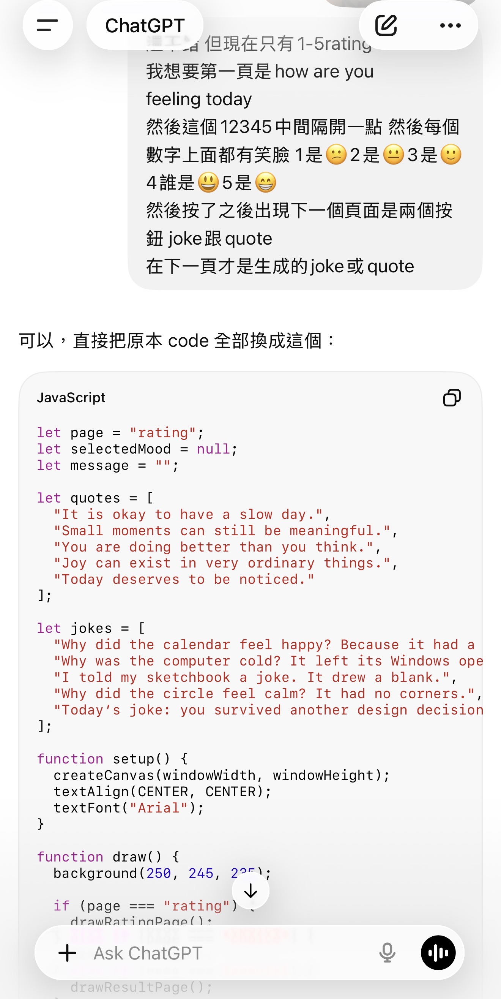

I used ChatGPT to help generate p5.js code for the QR code interaction prototype. I explained the interaction flow I wanted, including the mood rating page, emoji buttons, and the joke/quote response pages. ChatGPT helped me produce code quickly, which was useful because I did not need to build everything from the beginning by myself. However, the first version was not fully successful, so I had to revise my prompts several times and adjust the code through multiple iterations. This process showed me that AI was helpful for technical prototyping, but it still required my own testing, decision-making, and refinement to make the interaction fit my project.