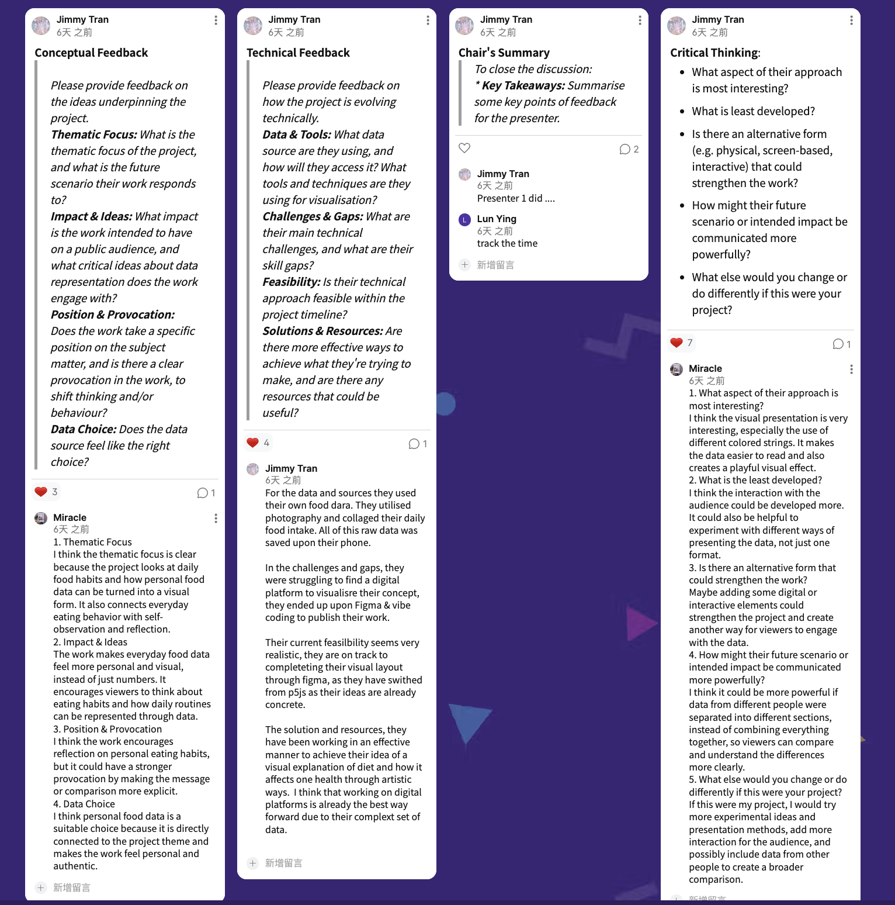
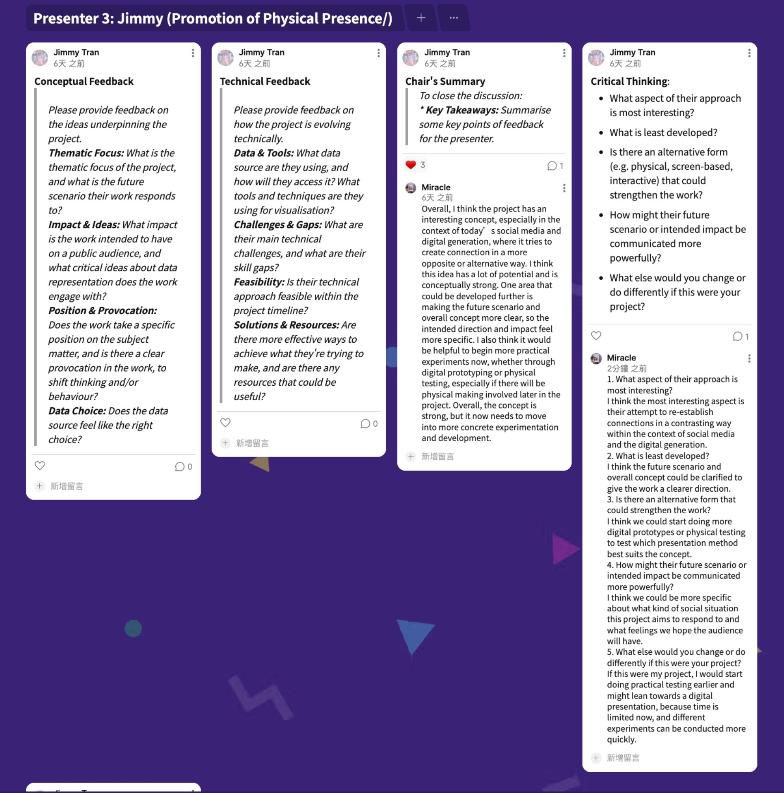
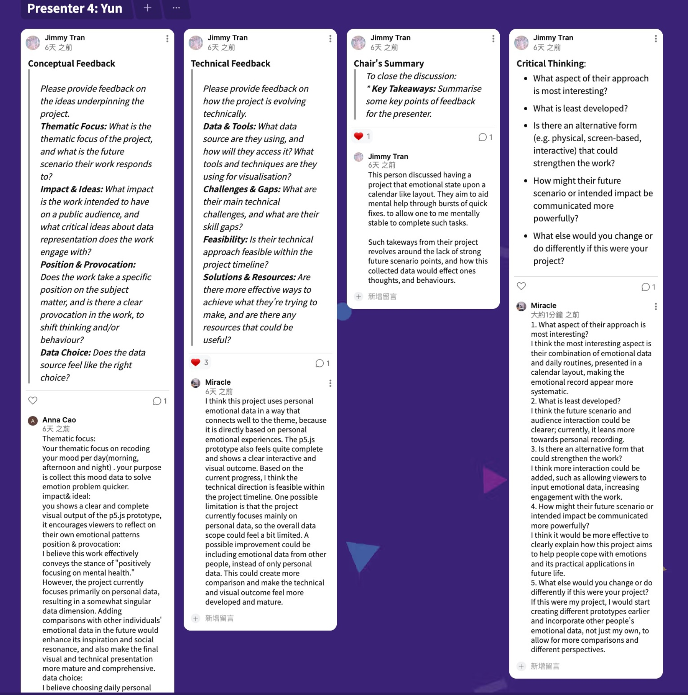
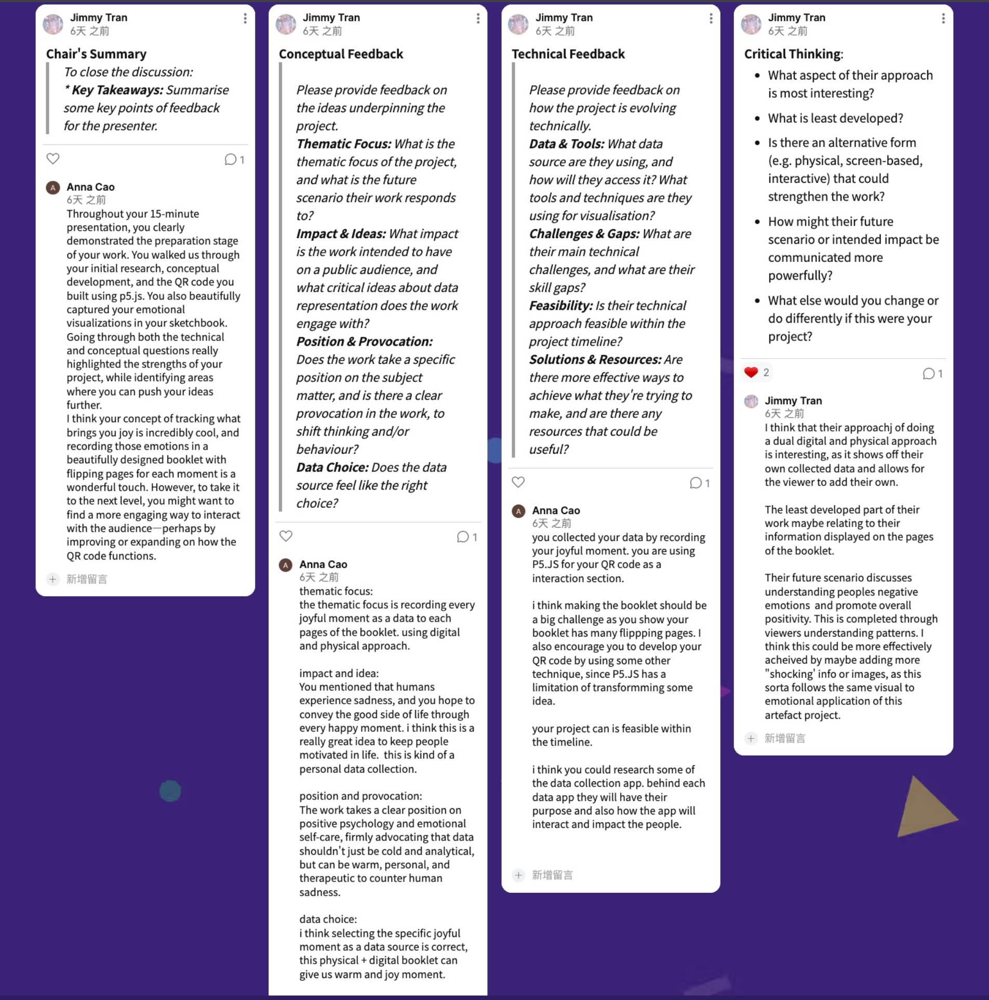
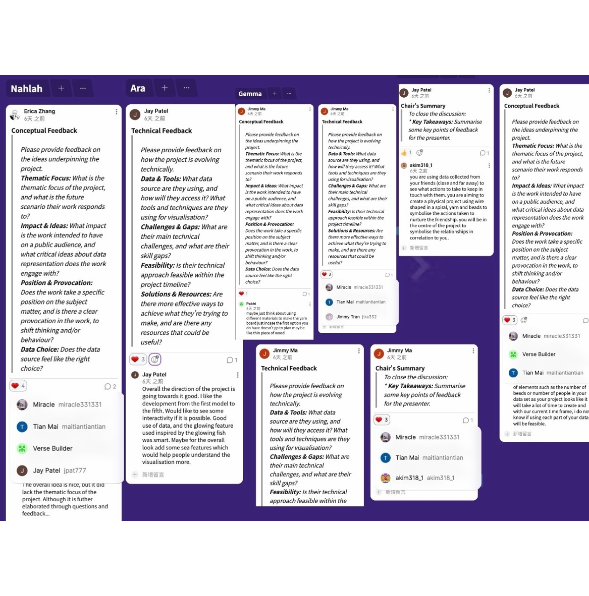
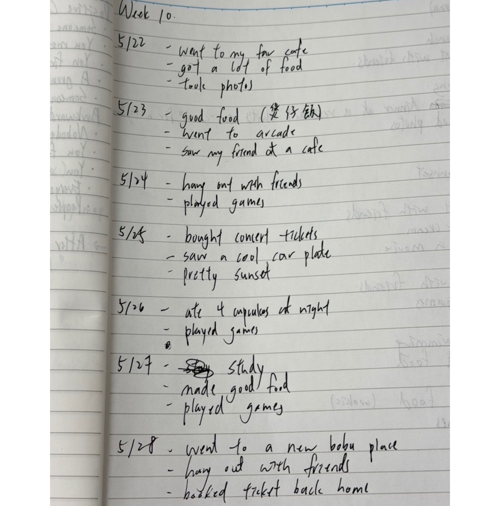
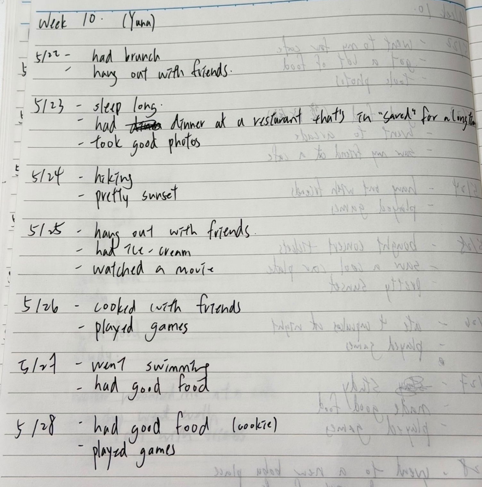
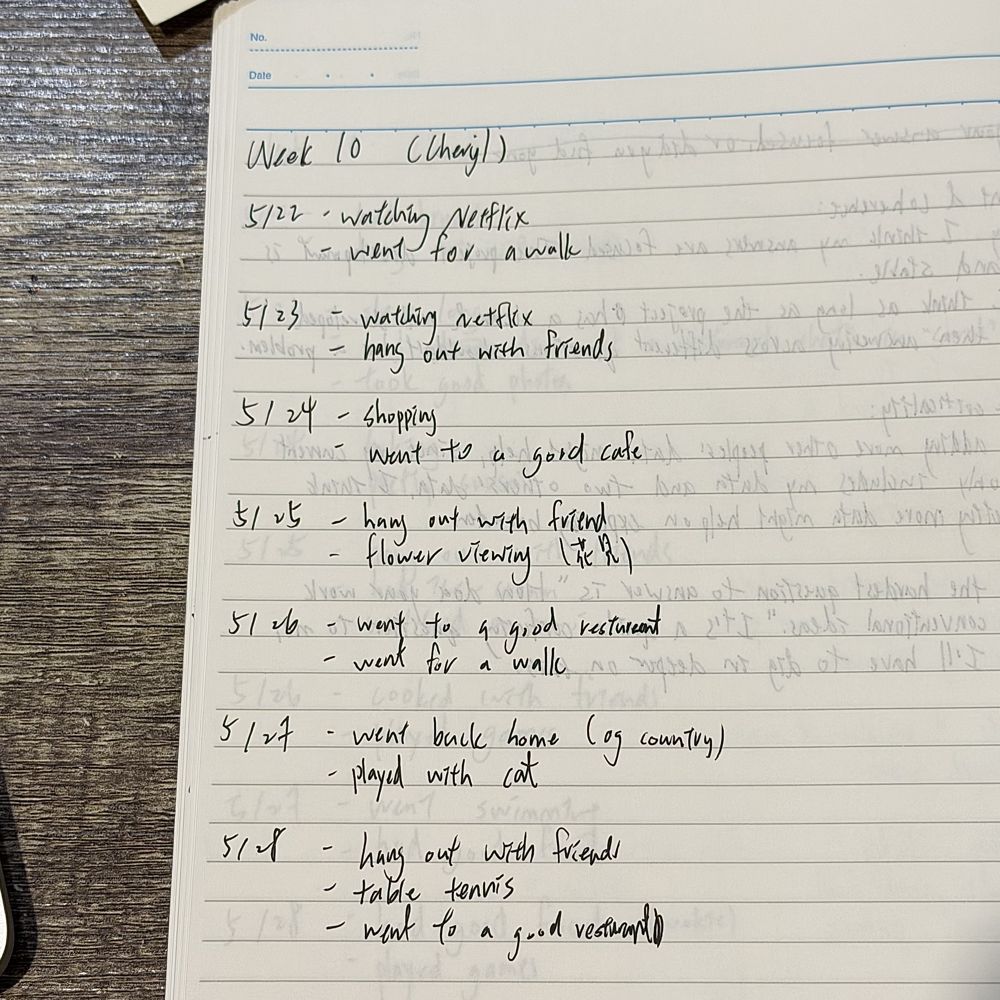
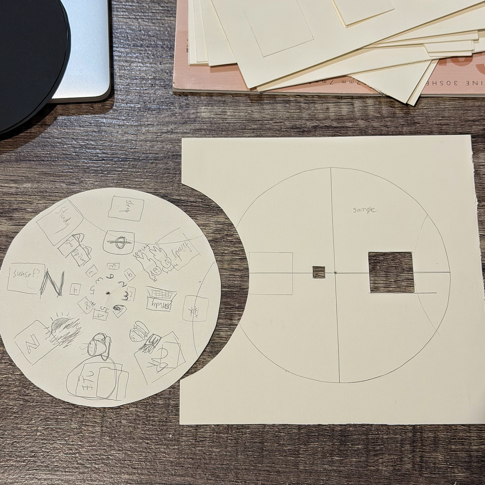
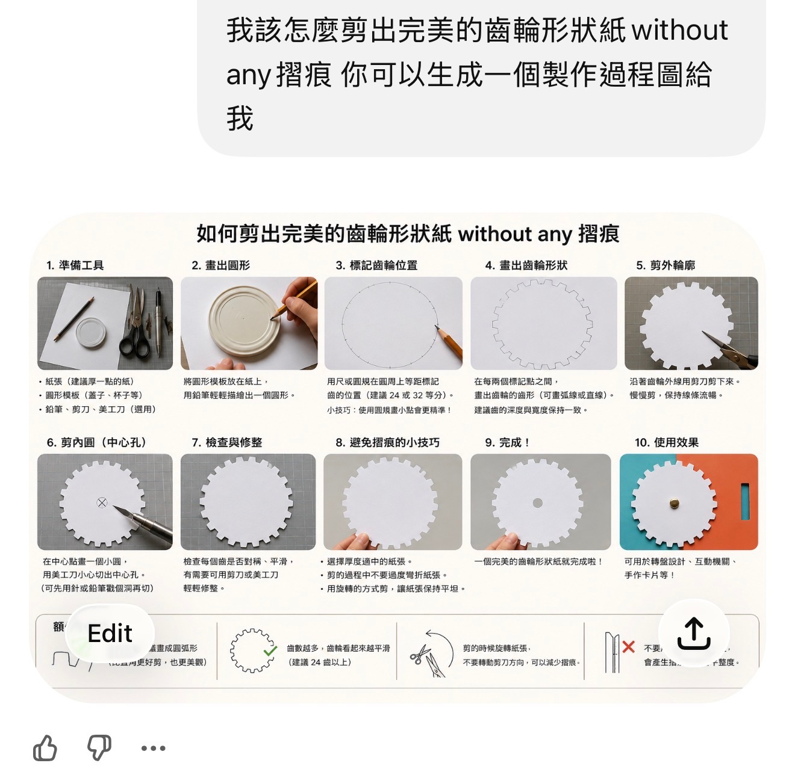

# Week 10

[← Back to Home](../index.md)

## Documentation 

**Action Plan**

The feedback I received this week has given me a clearer understanding of the project's strengths and areas for improvement. Many people found my combination of physical booklet and QR code interaction unique, and felt that this blend of digital and tactile experience created a warmer, more personal emotional connection. Some feedback also mentioned that the current p5.js prototype already has basic interactive effects, but audience interaction and future scenarios could be further developed. I also noticed that the current prototype leans more towards functional testing and hasn't fully captured the emotional experience I envision.

Based on this feedback, I will continue to refine the minor issues with the QR code interaction and begin more physical prototype testing, including page layout, pop-up structure, and page-turning interactions. I also want to make the overall narrative and emotional experience clearer, ensuring that the audience doesn't just view information but truly participates in moments of joy.

Furthermore, this critique experience made me realize that beyond the technology and interaction itself, it's crucial to help the audience understand the project's intended impact. Next, I want to further consider the content arrangement of each page in the booklet and how digital interaction can connect more naturally with physical experience. I will also continue to refer to different pop-up books, interactive publications, and emotional design references to help me better understand the direction of the final work.

**Project Development**

This week, I continued developing the physical book prototype from last week, focusing on the production and structural testing of the physical booklet. In addition to the original flip and hidden page interaction, I also began developing a new rotating wheel interaction, hoping to allow viewers to explore the content and emotional changes through more diverse interactive methods. These tests helped me better understand the interactive feel brought about by different paper structures and how physical interaction affects the overall emotional experience.

Furthermore, through this progress report and feedback, I rethought the audience participation aspect of the project. Although we already have digital interaction using p5.js, I began to realize that the physical booklet itself can also be part of audience participation. Therefore, I started developing a new idea: allowing viewers to freely draw elements or symbols representing their own "moments of joy" on one of the pages, similar to the visual emotion pages I designed previously. This is not just about viewing the artwork, but about allowing viewers to directly participate in the booklet's content, extending interaction beyond digital interaction to the physical interaction itself. Through this approach, the entire project has gradually evolved from a more personal emotional record into a more shared and interactive emotional experience.

## Images & Media
*Progress Report - Conceptual Commenter& Critical Thinking*
 
This workshop helped me think more critically about how concepts can be communicated through different forms of representation. By giving conceptual and critical feedback to others, I realised the importance of clarity between a project’s intention, audience, and visual outcome. It also made me reflect on how emotional or personal data can become more meaningful when supported by stronger interaction and comparison.

*Progress Report - Chair& Critical Thinking*
 
Acting as chair during the discussion improved my ability to summarise feedback and identify key strengths and weaknesses within different projects. Listening to multiple perspectives also helped me understand how audiences interpret ideas differently, especially when projects involve speculative or emotional themes.

*Progress Report - Technical Commenter& Critical Thinking*
 
Reviewing technical aspects of other projects helped me think more carefully about feasibility, interaction design, and the relationship between concept and execution. I became more aware that even strong concepts require clear systems, engaging interfaces, and realistic methods of presentation in order to communicate effectively.

*Progress Report - Received Feedback*
 
Receiving feedback from classmates helped me recognise both the strengths and limitations of my current project direction. Several comments suggested expanding interaction, incorporating perspectives beyond my own data, and creating clearer comparisons between emotional states. These discussions encouraged me to think about how the project could become more engaging, socially relevant, and visually developed.

*Gallery Walk*
 
I explored how different groups presented their concepts, speculative ideas, and visual communication methods through peer feedback boards. Although many projects were still in development, it was useful to observe how different students approached interaction, storytelling, and presentation structure. Reading the feedback and audience responses also helped me reflect on the importance of clarity and engagement within my own project. The experience encouraged me to think more critically about how visual organisation and audience interaction can influence the way a concept is understood and communicated.

*Moments of Joy documentatiton (My data)*
 
This week's journaling has made me notice recurring patterns in my happy emotions. Many moments of joy are related to food, friends, daily habits, and small snippets of life, rather than necessarily significant events. Through continued journaling, I've also begun to discover how different environments and interpersonal interactions affect my emotional state. This process has allowed me to go beyond simply collecting data and begin to understand the connection between daily behaviors and emotions.

*Moments of Joy documentatiton (Friend's data 1)*
 
This week I started collecting "moments of joy" data from my friends, trying to compare the emotional patterns among different people. I first asked my friends to simply record or take pictures of moments that made them happy during week 10, and then transcribe these moments into written form through oral accounts. This is the first friend's record. Through this process, I began to notice that different people's definitions of happiness actually have many similarities, such as food, interactions with friends, rest, and daily activities, and it also broadened my data sources beyond just personal experience.

*Moments of Joy documentatiton (Friend's data 2)*

 

This image records the "moments of joy" data of the second friend on week 10. I collected daily happy moments from different people using the same recording method, hoping to compare the emotional patterns and lifestyles of different individuals. By expanding the data sources, I began to observe which daily behaviors and environmental factors repeatedly appeared in the positive emotional experiences of different people, and considered how this data could be transformed into subsequent visual and interactive design directions.

*Project Development*

 

This is my current direction for the interactive booklet's development. While the physical prototype is still in its early stages, I've already begun planning new interactive pages, including a rotating wheel, flip interaction, and designs that allow viewers to participate in content creation. I hope that in addition to the original p5.js QR code interaction, the physical book itself can become another interactive medium. I also started thinking about how to make the work not just present my own emotional data, but also incorporate viewer participation. For example, I want to add a page where viewers can draw their own "moments of joy," allowing physical and digital interaction to coexist. Through these new design directions, I'm beginning to have a clearer understanding of the overall interactive flow and emotional experience of the final work.

## AI Usage Statement

 
This image documents my research into the construction of a rotating wheel. AI ​​provided some methods regarding the cutting process and avoiding paper creases, helping me quickly understand the basic logic of this interactive structure. However, I also found some aspects inaccurate. For example, it suggested drawing the gear shape by hand, but I think this could easily lead to uneven edges. Therefore, I still need to test and modify it further myself. This process made me realise that AI is better suited as a preliminary reference and inspiration tool, rather than a completely reliable answer.