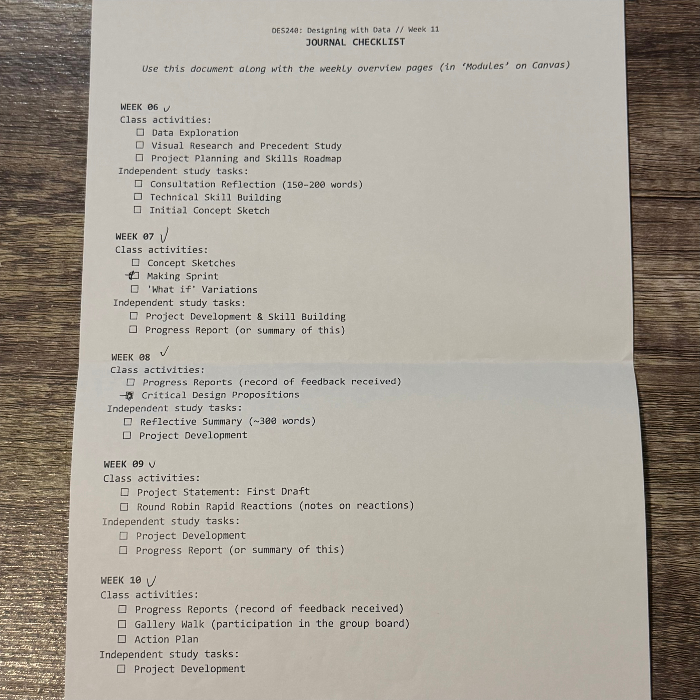
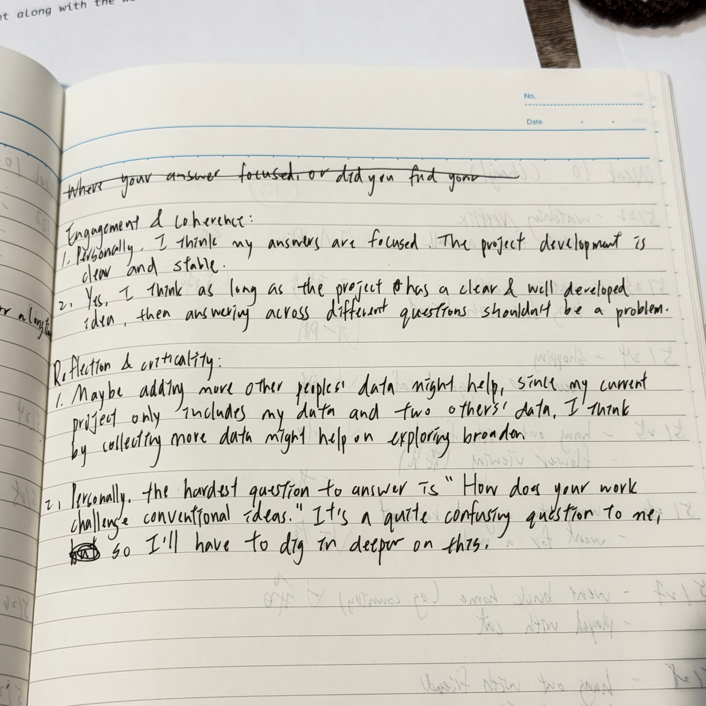
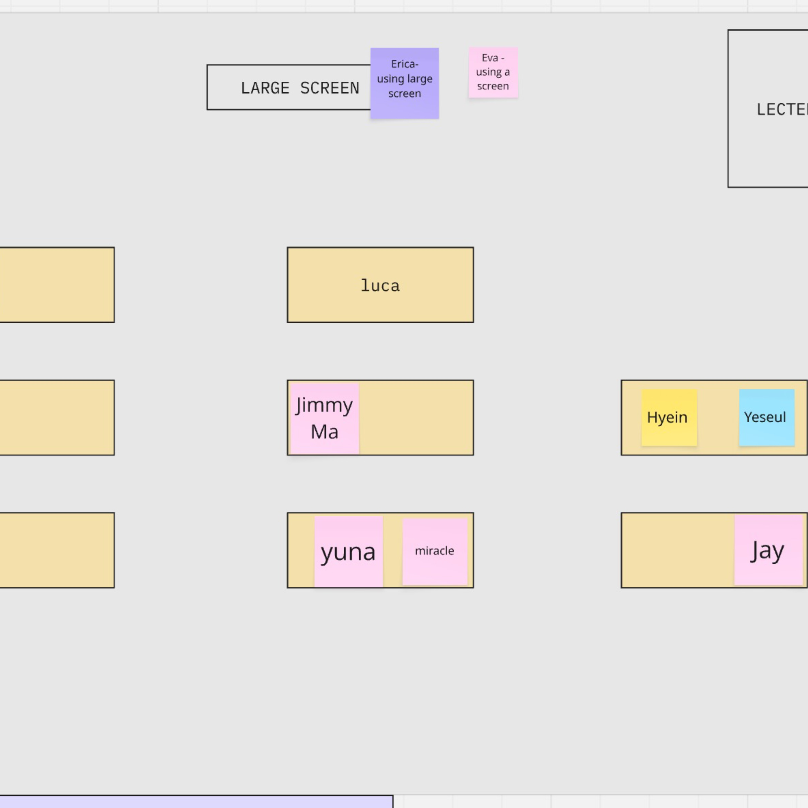
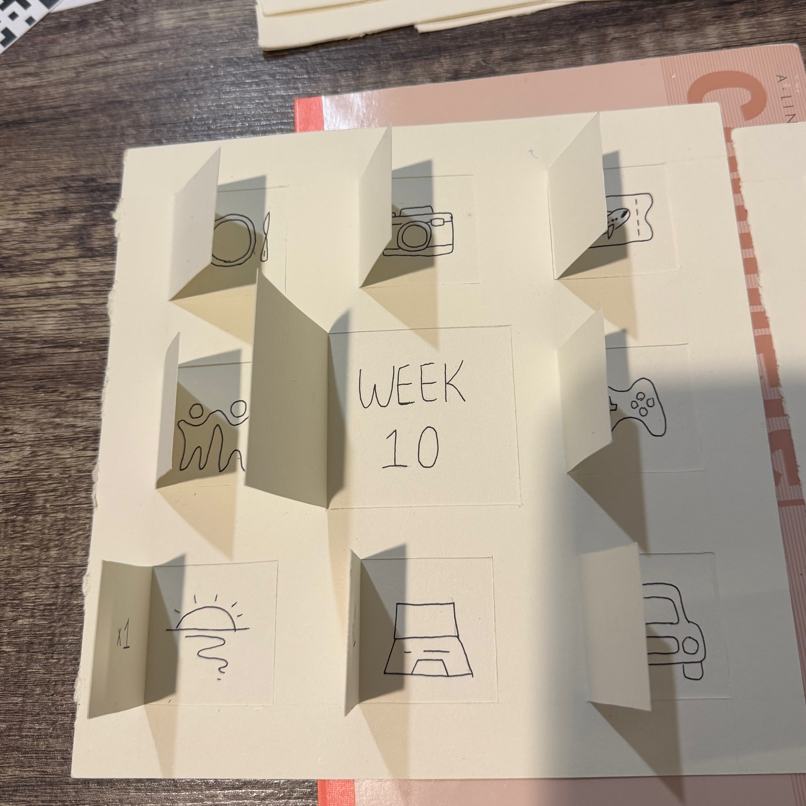
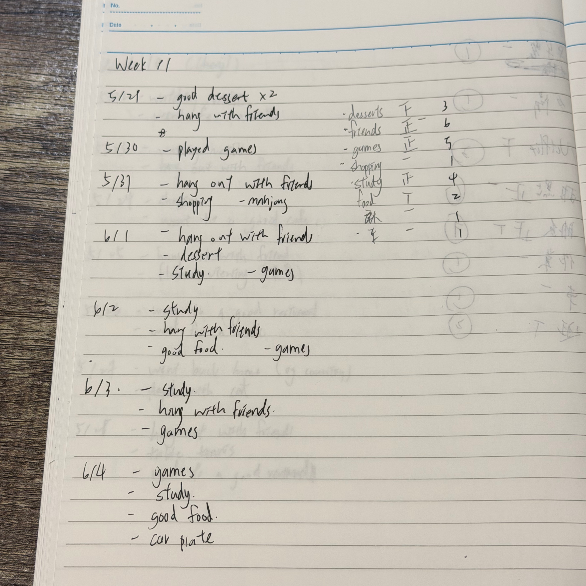
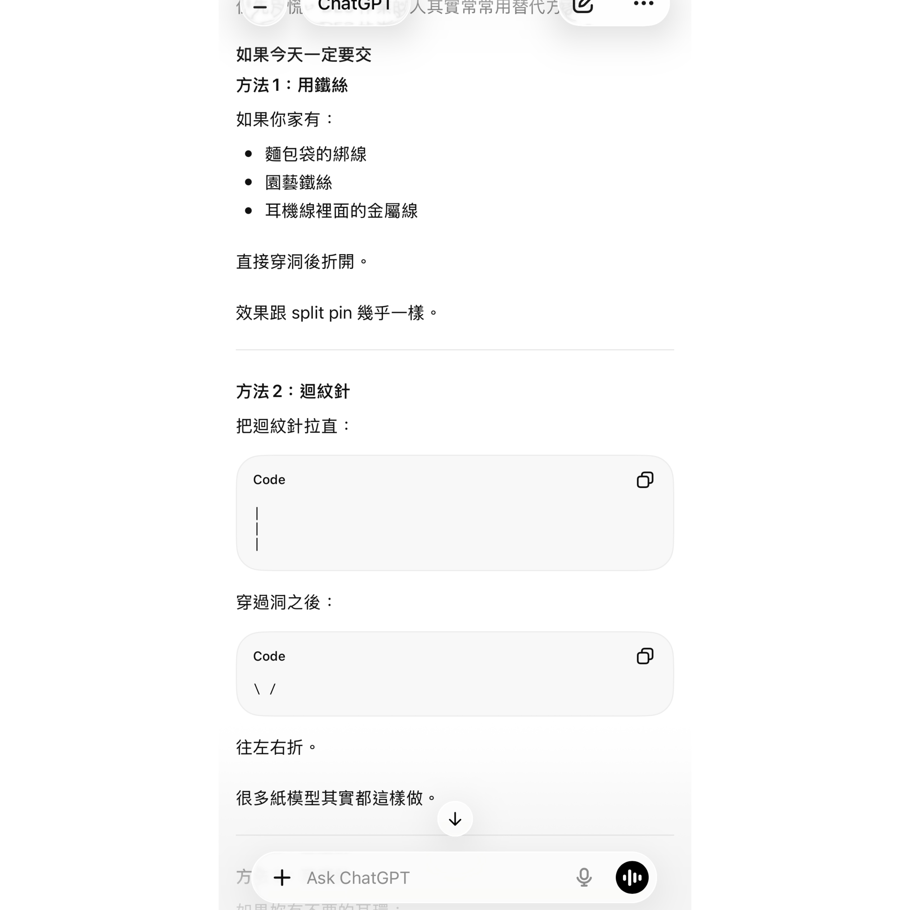

# Week 11

[← Back to Home](../index.md)

## Documentation 

TThis week focused on the final production and refinement of the artwork. After completing most of the data collection, content design, and page planning in the previous weeks, I shifted my focus to the creation of the physical interactive structure and the overall assembly of the piece.

The biggest challenge at this stage was the creation of the turntable mechanism. Initially, I thought it would be a relatively simple structure, but I discovered it required extensive testing and adjustments after starting production. To ensure the turntable rotated smoothly while maintaining structural stability, I repeatedly created multiple test models, experimenting with different sizes, spacing, and assembly methods. Even the smallest dimensional error could affect the final interactive effect, thus requiring more time than expected for modification and verification.

Besides the turntable, assembling the individual pages was also more complex than anticipated. Since each page contained different interactive designs and paper structures, I had to carefully confirm the positions, alignments, and relationships between the papers to ensure smooth page turning and operation. During assembly, I continuously corrected details to make the overall presentation more complete.

Through this stage of production, I gained a deeper understanding of the importance of repeated testing and iteration for physical interactive works. Although I encountered many technical challenges, it gradually transformed my initial concept into a truly functional piece. By the end of the week, most of the pages and interactive elements were completed, with only final assembly and fine-tuning remaining. The artwork was nearing its final presentation.

## Images & Media

*Journal Review*

 

Reviewing the journal checklist helped me identify any missing content and ensure my journal was organised and complete. It also gave me a clearer understanding of the assessment expectations and increased my confidence before submission.

*Practice Consultations*

 

The practice consultation encouraged me to rethink aspects of my project and helped me simulate the experience of presenting my work in next week's showcase. Through discussing my project with a peer, I was prompted to consider questions and perspectives that I had not previously thought about, particularly regarding "How does your work challenge conventional ideas?"

*Showcase Planning*

 

As my project does not require a screen or additional equipment, I chose a central table location for the showcase. The work will be presented as a physical booklet that visitors can browse through independently. By turning the pages and exploring the collected data, audiences can follow the development of the project and reflect on the relationship between everyday experiences, joy, and emotional wellbeing.

*Independent Study - Final development*
 

At this stage, nearly all pages of the project had been completed. The remaining work focused on assembling the different components into a finished book and making sure the interactions worked smoothly together. Reviewing the project as a whole allowed me to reflect on how the pages connected with one another and whether the final experience communicated the idea of “Moments of Joy” clearly to viewers.

*Moments of Joy documentatiton (My data)*

 
This is the final week of my Moments of Joy data recording. In addition to recording happy events each day, I also started organizing the frequency of different categories. Through this process, I observed that certain activities repeatedly appeared in the data, indicating that they have a sustained and stable positive impact on my emotions.

## AI Usage Statement

 
While building the rotating wheel component of my project, I originally intended to use a split pin to connect the moving parts. After struggling to find one, I consulted ChatGPT for alternative solutions. It suggested a simple wire-based fastening method that could achieve a similar function. I tested this solution and eventually used it in the final model. AI supported the technical development of the project by helping me solve a fabrication problem and identify practical alternatives.