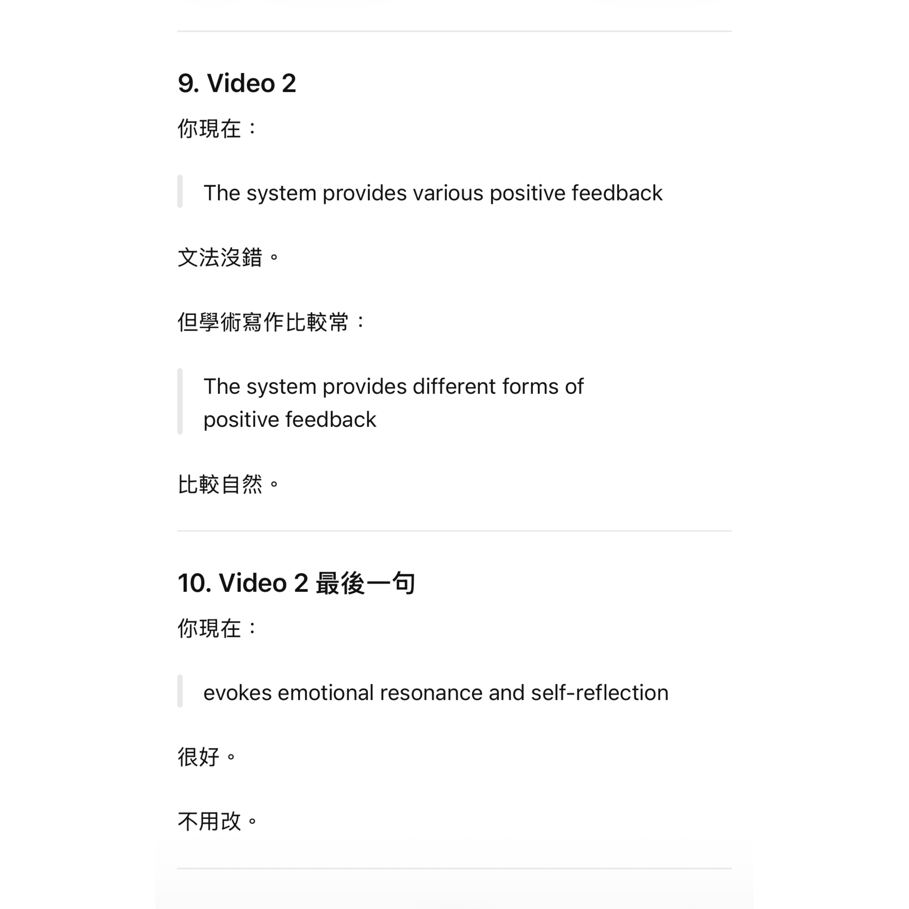

# Week 12

[← Back to Home](../index.md)

## Documentation 

**Project Statement**

"Moments of Joy" is a visual work combining a handcrafted pop-up book with digital interaction. The work is based on my record of happy moments in daily life. By continuously recording small events that make me happy, relaxed, or fulfilled each day, I explore the relationship between emotions and daily behaviors.

In the process of collecting data, I discovered that many moments of happiness actually come from very small and easily overlooked moments, such as spending time with friends, eating favorite food, seeing beautiful scenery, or completing something I was initially worried about not doing well. These experiences, though ordinary, have a significant impact on emotional state.

Therefore, I chose to present the data in the form of a pop-up book, hoping to break through the more rational and abstract presentation methods of traditional charts or digital dashboards. Viewers can gradually explore the stories behind the data by turning pages, operating gears, and viewing the pop-up structure, making the data not just something to be read, but something to be experienced.

The work also incorporates a QR code interaction, inviting viewers to assess their current emotional state. The system provides an encouraging message or a lighthearted joke based on different mood scores, transforming viewers from viewers into participants. Through this interaction, I hope to establish an emotional connection between the audience and the work, and remind people that even amidst busyness and stress, it's still worthwhile to pay attention to the small but precious moments of joy in life.

During the production process, I also began to rethink the possibilities of visualizing information. Information doesn't necessarily have to be presented as numbers or charts; it can also become a medium for carrying emotions and personal stories, helping people understand their own and others' experiences in a more empathetic way.

**Reflection on the Final Outcome**

Completing this project encouraged me to critically reflect on my assumptions about data visualisation. In the past, I often understood data as information that needed to be quantified, organised, and analysed. However, in this project, I discovered that data can also carry emotions, memories, and personal experiences. By recording joyful moments in daily life, I gradually realised that many seemingly insignificant events actually have a lasting and profound impact on emotional states.

During the production process, I tried to transform these abstract emotional data into tangible forms that could be browsed, touched, and explored, rather than relying on traditional charts. This made me realise that data visualisation is not just about pursuing efficiency in information delivery; it can also be a way to build emotional connections and narrative experiences.

I hope this project will encourage viewers to slow down and pay attention to those easily overlooked everyday moments. I also hope this work will demonstrate that data is not just a collection of numbers, but a medium that can carry stories, emotions, and human experiences. This project has given me a broader understanding of data visualisation and shown me how design can build new connections between information and emotion.

## Images & Media

*Video 1 - Final Artegact Overview*

This video showcases the complete interactive process of Moments of Joy, starting with the viewer opening the cover and gradually flipping through the pages to explore the information within. Using a handcrafted pop-up book as its primary medium, the work guides viewers step-by-step through the process of turning pages, lifting paper flaps, rotating a paper wheel, and reading different visual elements, leading them to understand the data on joyful moments collected over six weeks.

Unlike traditional methods of visualising data primarily through charts or numbers, I wanted viewers to engage with the data through hands-on interaction. Each interactive mechanism corresponds to a different type of data and life experience, making the viewing process more like reading a story rather than simply receiving information. As the pages unfold, viewers not only see the content of the data but also understand the everyday experiences and emotional changes it represents.

Through this process, I hope to transform abstract emotional data into an experience with tactile, spatial, and emotional connections, allowing the data to be felt and experienced, not just viewed.

*Video 2 - QR Code Interaction*

<video controls width="100%">
  <source src="../assets/week-12/screen-recording2.mp4" type="video/mp4">
</video>

This video showcases the final digital interactive portion of the artwork. After viewing the physical work, viewers can scan a QR code to access an interactive website and assess their current emotional state.

The system provides various positive feedback based on the user's chosen mood score, including encouraging messages and lighthearted jokes. This design not only continues the theme of "happy moments" in the artwork but also encourages viewers to shift from observing my data to reflecting on their own emotions and life experiences.

I hope this interaction will establish a more direct connection between the artwork and the audience. Compared to a one-way display of personal information, this digital element invites viewers to become part of the artwork, extending the core concept from "recording happiness" to "discovering one's own happiness." Through the combination of physical and digital media, the artwork ultimately goes beyond simply presenting data; it creates an experience that evokes emotional resonance and self-reflection.

## AI Usage Statement
 

ChatGPT was used as a writing support tool during the final stage of the project. It assisted with refining the wording, structure, and clarity of the project statement, reflection, and documentation captions. All final written content was reviewed, edited, and adapted by me to accurately represent my project, design process, and intentions.